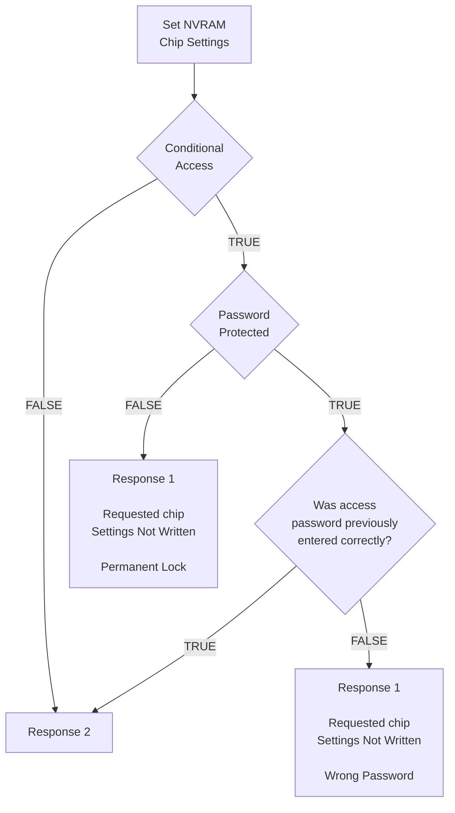
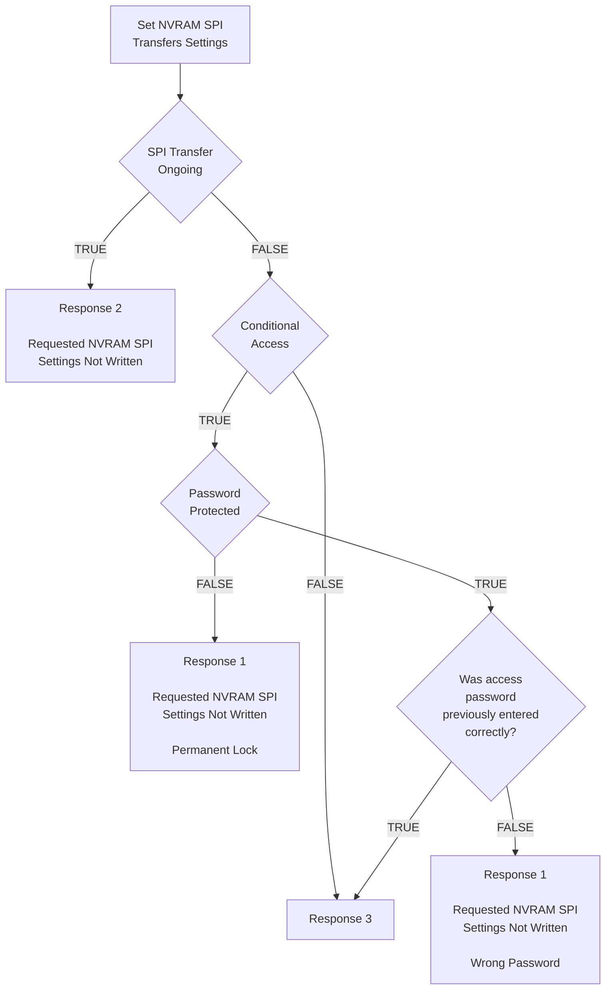
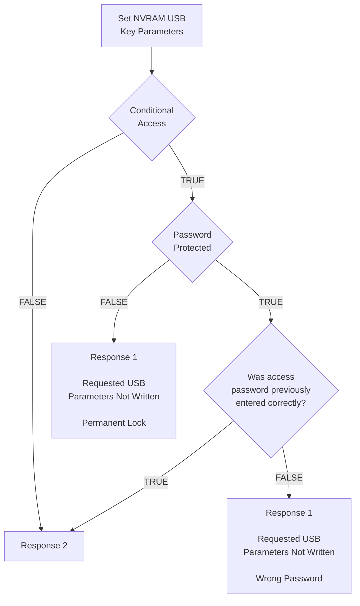
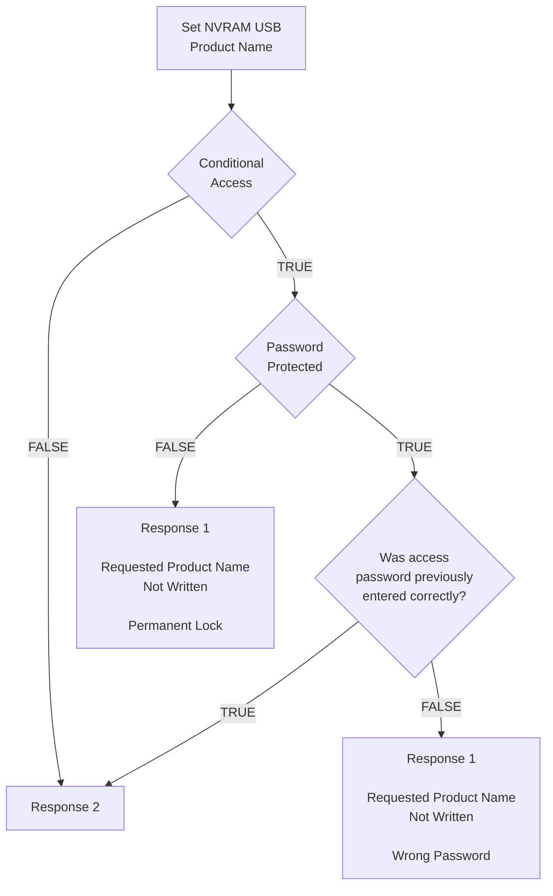
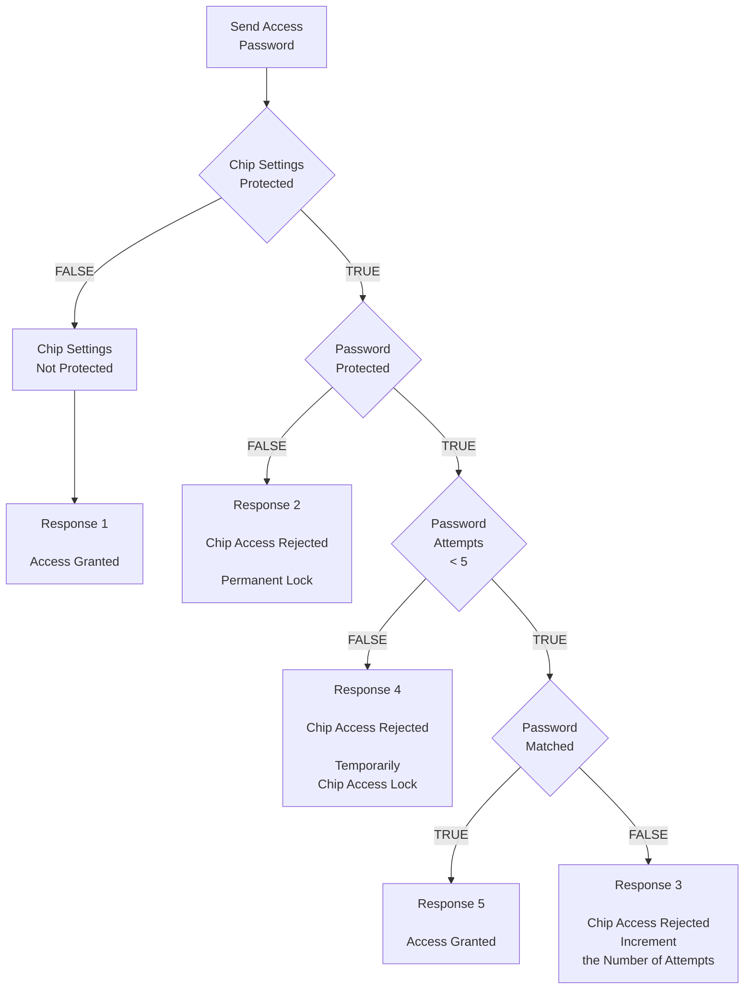
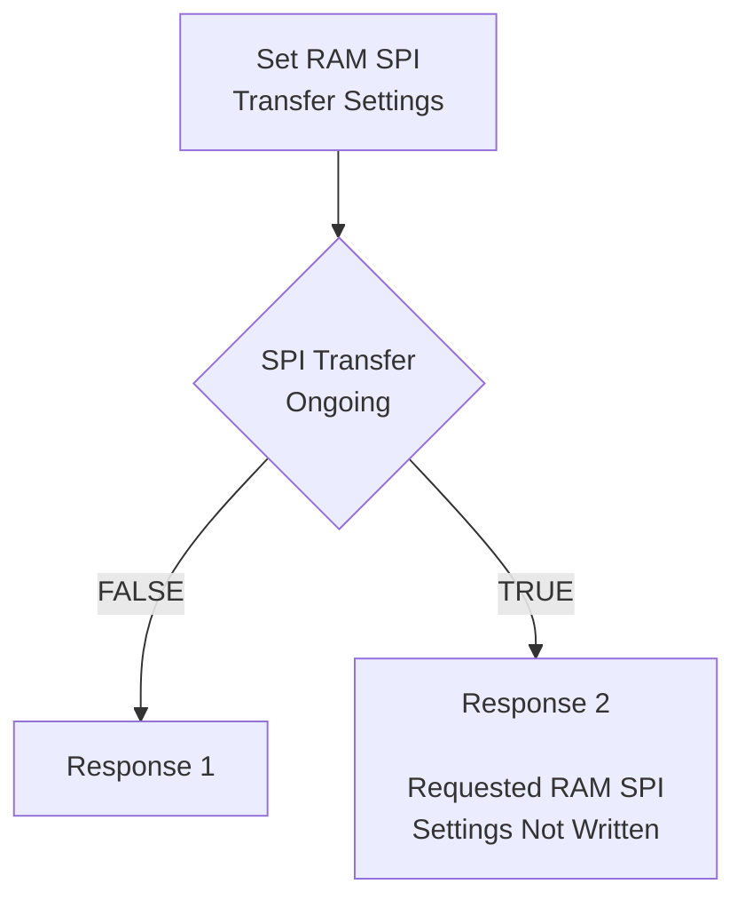
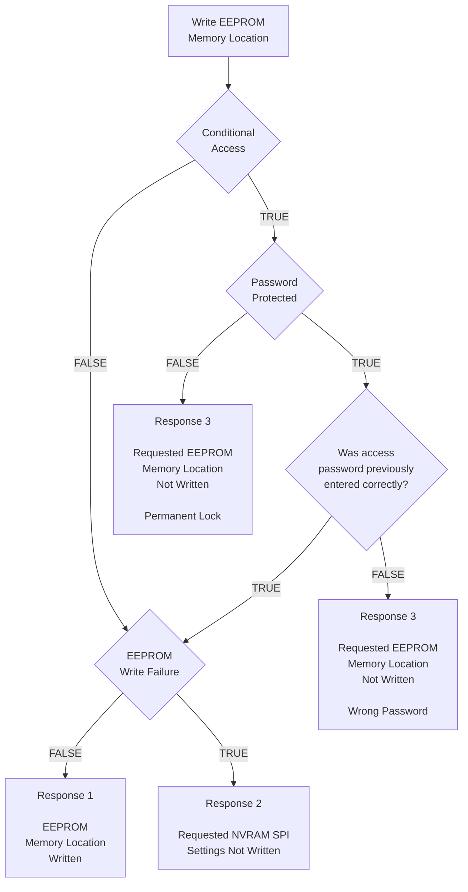
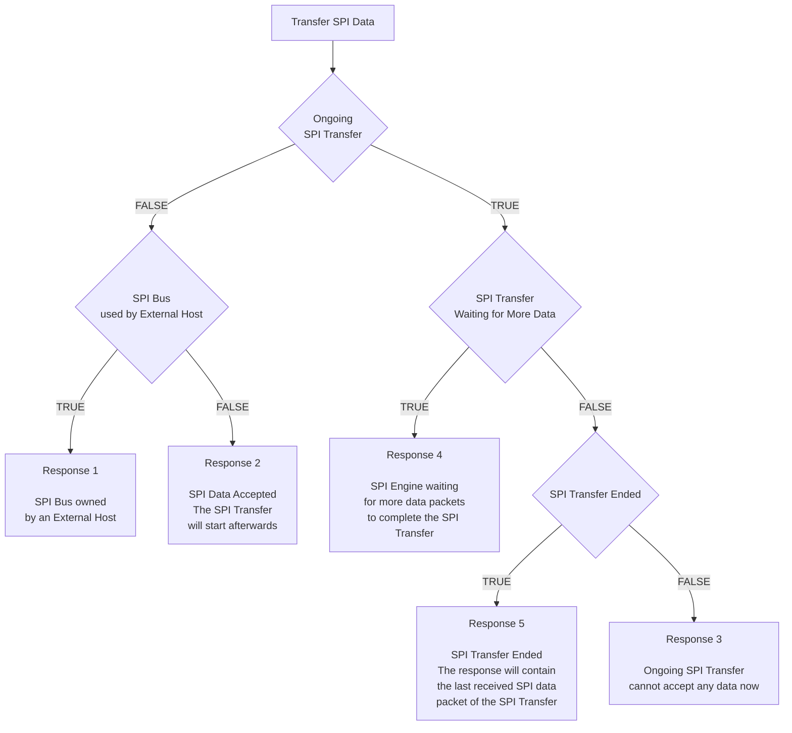

# 1.1 Supported Operating Systems

The following operating systems are supported:
* Windows XP/Vista/7/8/8.1/10
* Linux
* Mac OS

## 1.1.1 ENUMERATION

The MCP2210 will enumerate as a USB device after Power-on Reset (POR). The device enumerates as a Human Interface Device (HID) only.

### 1.1.1.1 Human Interface Device (HID)

The MCP2210 enumerates as an HID, so the device can be configured and all the other functionalities can be controlled. A DLL package that facilitates I/O control through a custom interface is supplied by Microchip and is available on the product landing page.

---

# 1.2 Control Module

The control module is the heart of the MCP2210. All other modules are tied together and controlled via the control module. The control module manages the data transfers between the USB and the SPI, as well as command requests generated by the USB host controller, and commands for controlling the function of the SPI and I/O.

## 1.2.1 SPI INTERFACE

The control module interfaces to the SPI and USB modules.

## 1.2.2 INTERFACING TO THE DEVICE

The MCP2210 can be accessed for reading and writing via USB host commands. The device cannot be accessed and controlled via the SPI interface.

---

# 1.3 SPI Module

The MCP2210 SPI module provides the MOSI, MISO and SCK signals to the outside world. The module has the ability to control the GP pins (as Chip Select) only if these pins are configured for Chip Select operation.

## 1.3.1 SPI MODULE FEATURES

The SPI module has the following configurable features:
* Bit rates
* Delays
* Chip Select pin assignments (up to 8 Chip Select lines)

All the above features are available for customization using certain USB commands.

## 1.3.2 SPI MODULE POWER-UP CONFIGURATION

Default parameters:
* 1 Mbit
* 4 bytes to transfer per SPI transaction
* GP1 as Chip Select line

---

# 1.4 USB Protocol Controller

The USB controller in the MCP2210 is full-speed USB 2.0 compliant.

* HID only device used for:
  * SPI transfers
  * I/O control
  * EEPROM access
  * Chip configuration manipulation
* 128-byte buffer to handle data for SPI transfers:
  * 64-byte transmit
  * 64-byte receive
* Fully configurable VID, PID assignments, string descriptors (stored on-chip) and chip power-up settings (default chip settings and SPI transfer parameters)
* Bus powered or self-powered

## 1.4.1 DESCRIPTORS

The string descriptors are stored internally in the MCP2210 and they can be changed so when the chip enumerates, the host gets the customer’s own product and manufacturer names. They can be customized to the user’s needs by using the Microchip provided configuration utility or a custom built application that will send the proper USB commands for storing the new descriptors into the chip.

## 1.4.2 USB EVENTS

The MCP2210 provides support for signaling important USB-related events such as:

* USB Suspend and Resume – these states are signaled on the GP2, if the pin is configured for its dedicated function:
  * USB Suspend mode is entered when a suspend signaling event is detected on the USB bus
  * USB Resume is signaled when one of the following events is occurring:
    * a) Resume signaling is detected or generated
    * b) A USB Reset signal is detected
    * c) A device Reset occurs
* USB device enumerated successfully (this state is signaled if the GP4 is configured for its dedicated function)
* USB Low-Power mode

---

# 1.5 USB Transceiver

The MCP2210 has a built-in, USB 2.0, full-speed transceiver internally connected to the USB module. The USB transceiver obtains power from the VUSB pin, which is internally connected to a 3.3V internal regulator. The best electrical signal quality is obtained when VUSB is locally bypassed with a high-quality ceramic capacitor.

The internal 3.3V regulator draws power from the VDD pin. In certain scenarios, where VDD is lower than 3.3V + internal LDO dropout, the VUSB pin must be tied to an external regulated 3.3V. This will allow the USB transceiver to work correctly, while the I/O voltage in the rest of the system can be lower than 3.3V. As an example, in a system where the MCP2210 is used and the I/O required is of 3.0V, the VDD of the chip will be tied to the 3.0V digital power rail, while the VUSB pin must be connected to a regulated 3.3V power supply.

## 1.5.1 INTERNAL PULL-UP RESISTORS

The MCP2210 device has built-in pull-up resistors designed to meet the requirements for full-speed USB.

## 1.5.2 MCP2210 POWER OPTIONS

The following are the main power options for the MCP2210:
* USB Bus Powered (5V)
* Self Powered (from 3.3V to 5V), while the VUSB pin is supplied with 3.3V (regulated). If the VDD is powered with 5V, then the VUSB will be powered by the internal regulator and the VUSB pin will need only a decoupling capacitor

### 1.5.2.1 Internal Power Supply Details

MCP2210 offers various options for power supply. To meet the required USB signaling levels, MCP2210 device incorporates an internal LDO used solely by the USB transceiver, in order to present the correct D+/D- voltage levels.

Figure 1-1 shows the internal connections of the USB transceiver LDO in relation with the VDD power supply rail. The output of the USB transceiver LDO is tied to the VUSB line.

A capacitor connected to the VUSB pin is required if the USB transceiver LDO provides the 3.3V supply to the transceiver. The provided VDD voltage has a direct influence on the voltage levels present on the GPIO and SPI module pins (GP8-GP0, MOSI, MISO and SCK). When VDD is 5V, all of these pins will have a logical ‘1’ around 5V with the variations specified in Section 4.1 “DC Characteristics”.

For applications that require a 3.3V logical ‘1’ level, VDD must be connected to a power supply providing the 3.3V voltage. In this case, the internal USB transceiver LDO cannot provide the required 3.3V power. It is necessary to also connect the VUSB pin of the MCP2210 to the 3.3V power supply rail. This way, the USB transceiver is powered up directly from the 3.3V power supply.

### 1.5.2.2 USB Bus Powered (5V)

In Bus Power Only mode, the entire power for the application is drawn from the USB (see Figure 1-2). This is effectively the simplest power method for the device.

In order to meet the inrush current requirements of the USB 2.0 specifications, the total effective capacitance appearing across VBUS and ground must be no more than 10 μF. If it is more than 10 μF, some kind of inrush limiting is required. For more details on Inrush Current Limiting, see the current Universal Serial Bus Specification.

According to the USB 2.0 specification, all USB devices must also support a Low-Power Suspend mode. In the USB Suspend mode, devices must consume no more than 500 μA (or 2.5 mA for high powered devices that are remote wake-up capable) from the 5V VBUS line of the USB cable.

The host signals the USB device to enter Suspend mode by stopping all USB traffic to that device for more than 3 ms.

The USB bus provides a 5V voltage. However, the USB transceiver requires 3.3V for the signaling (on D+ and D- lines).

During USB Suspend mode, the D+ or D- pull-up resistor must remain active, which will consume some of the allowed suspend current budget (500 μA/2.5 mA).

The VUSB pin is required to have an external bypass capacitor. It is recommended that the capacitor be a ceramic cap, between 0.22 and 0.47 μF.

Figure 1-3 shows a circuit where the MCP2210 internal LDO is used to provide 3.3V to the USB transceiver. The voltage on the VDD affects the voltage levels onto the GP and SPI module pins (GP8-GP0, MOSI, MISO and SCK). With VDD at 5V, these pins will have a logic ‘1’ of 5V with the variations specified in Section 4.1 “DC Characteristics”.

### 1.5.2.3 3.3V – Self Powered

Typically, many embedded applications are using 3.3V or lower power supplies. When such an option is available in the target system, MCP2210 can be powered up (VDD) from the existing power supply rail. The typical connections for MCP2210 powered from 3.3V rail are shown in Figure 1-4.

In this example MCP2210 has both VDD and VUSB lines tied to the 3.3V rail. These tied connections disable the internal USB transceiver LDO of the MCP2210 to regulate the power supply on VUSB pin. Another consequence is that the ‘1’ logical level on the GP and SPI pins will be at the 3.3V level, in accordance with the variations specified in Section 4.1 “DC Characteristics”.

---

# 1.6 GP Module

The GP module features eight I/O lines and one input line.

## 1.6.1 CONFIGURABLE PIN FUNCTIONS

The pins can be configured as:
* **GPIO** – individually configurable, general purpose input or output
* **Chip Select pins** – used by the SPI module
* **Alternate function pins** – used for miscellaneous features such as:
  * **SSPND** – USB Suspend and Resume states
  * **USBCFG** – indicates USB configuration status
  * **LOWPWR** – signals when the host does not accept the requirements (presented during enumeration) and the chip is not configured. In this mode, the whole system powered from the USB host should draw up to 100 mA.
  * **External Interrupt Input** – used to count external events
  * **SPI bus Release Request** – used to request SPI bus access from the MCP2210
  * **SPI bus Release Acknowledge** – used to acknowledge when the MCP2210 has released the SPI bus
  * **LED** – indicates SPI traffic led

### 1.6.1.1 GPIO Pins Function

The GP7-0 pins (if enabled for GPIO functionality) can be used as digital inputs/outputs. The GP8 pin can be used only as a digital input.

These pins can be read (both inputs and outputs) and written (only the outputs).

### 1.6.1.2 Chip Select Pins Function

The GP pins (if enabled for the Chip Select functionality) are controlled by the SPI module. Their Idle/Active value is determined by the SPI transfer parameters.

### 1.6.1.3 SSPND Pin Function

The GP2 pin (if enabled for this functionality) reflects the USB state (Suspend/Resume). The pin is active ‘low’ when the Suspend state has been issued by the USB host.

Likewise, the pin drives ‘high’ after the Resume state is achieved.

This pin allows the application to go into Low-Power mode when USB communication is suspended, and switches to a full active state when USB activity is resumed.

### 1.6.1.4 USBCFG Pin Function

The GP5 pin (if enabled for this functionality) starts out ‘high’ during power-up or after Reset, and goes ‘low’ after the device successfully configures to the USB. The pin will go ‘high’ when in Suspend mode and ‘low’ when the USB resumes.

### 1.6.1.5 LOWPWR Pin Function

The GP4 pin (if enabled for this functionality) starts out ‘low’ during power-up or after Reset, and goes ‘high’ after the device successfully configures to the USB. The pin will go ‘low’ when in Suspend mode and ‘high’ when the USB resumes.

### 1.6.1.6 External Interrupt Input Pin Function

The GP4 pin (if enabled for this functionality) is used as an interrupt input pin and it will count interrupt events such as:
* Falling edges
* Rising edges
* Low-logic pulses
* High-logic pulses

### 1.6.1.7 SPI Bus Release Request Pin Function

The GP8 pin (if enabled for this functionality) is used by an external device to request the MCP2210 to release the SPI bus. This way, more than one SPI host can have access to the SPI client chips on the bus. When this pin is driven ‘low’, the MCP2210 will examine the request and, based on the conditions and internal logic, it might release the SPI bus. If there is an ongoing SPI transfer taking place at the moment when an external device requests the bus, MCP2210 will release it after the transfer is completed or if the USB host cancels the current SPI transfer.

### 1.6.1.8 SPI Bus Release Acknowledge Pin Function

The GP7 pin (if enabled for this functionality) is used by the MCP2210 to signal back if the SPI bus was released. When a SPI bus release request is registered by the MCP2210, based on the condition and internal logic, the chip might release the bus. The bus is released immediately if there is no SPI transfer taking place, or it will do so after the current SPI transfer is finished or cancelled by the USB host.

### 1.6.1.9 LED Pin Function

The GP3 pin (if enabled for this functionality) is used as an SPI traffic indication. When an SPI transfer is taking place (active state for this pin), this pin will be driven ‘low’. When there is no SPI traffic taking place, the pin is in its inactive state or logic ‘high’.

---

# 1.7 EEPROM Module

The EEPROM module is a 256-byte array of nonvolatile memory. The memory locations are accessed for read/write operations solely via USB host commands. The memory cells for data EEPROM are rated to endure thousands of erase/write cycles, up to 100K for EEPROM.

Data retention without refresh is conservatively estimated to be greater than 40 years.

---

# 1.8 Reset/POR

## 1.8.1 RESET PIN

The RST pin provides a method for triggering an external Reset of the device. A Reset is generated by holding the pin low. MCP2210 has a noise filter in the Reset path which detects and ignores small pulses.

## 1.8.2 POR

A POR pulse is generated on-chip whenever VDD rises above a certain threshold. This allows the device to start in the initialized state when VDD is adequate for operation.

To take advantage of the POR circuitry, tie the RST pin through a resistor (1 kΩ to 10 kΩ) to VDD. This will eliminate external RC components usually needed to create a POR delay.

When the device starts normal operation (i.e., exits the Reset condition), the device operating parameters (voltage, frequency, temperature, etc.) must be met to ensure operation. If these conditions are not achieved, the device must be held in Reset until the operating conditions are met.

---

# 1.9 Oscillator

The input clock must be 12 MHz to provide the proper frequency for the USB module. USB full-speed is nominally 12 Mb/s. The clock input accuracy is ±0.25% (2,500 ppm maximum).

---

# 2.0 MCP2210 FUNCTIONAL DESCRIPTION

The MCP2210 uses NVRAM to store relevant chip settings. These settings are loaded by the chip during the power-up process and they are used for GP designation and SPI transfers.

The NVRAM settings at power-up (or Reset) are loaded into the RAM portion of the chip and they can be altered through certain USB commands. This is very useful since it allows dynamic reconfiguring of the GPs or SPI transfer parameters. A practical example to illustrate this mechanism is a system which uses at least two SPI client chips and the GPs in the MCP2210 for various GPIO purposes. The default SPI settings might be ok for one of the SPI client chips, but not for the 2nd. At first, the PC application will make an SPI transfer to the first chip, using the NVRAM copy of the SPI settings. Then, by sending a certain USB command, the SPI transfer settings residing in RAM will be altered in order to fit the SPI transfer requirements of the second chip.

Also, if the altered SPI transfer settings are needed to be the default power-up (or Reset) settings for SPI, the user can send a series of USB commands in order to store the current (RAM) SPI settings into NVRAM. In this way, these new settings will be the power-up default SPI settings.

The NVRAM settings and EEPROM contents can be protected by password access means, or they can be permanently locked without any possible further modification.

## 2.1 MCP2210 NVRAM Settings

The chip settings that can be stored in the NVRAM area are as follows:

* SPI transfer parameters:
  * SPI bit rate
  * SPI mode
  * Idle Chip Select values
  * Active Chip Select values
  * SPI transfer configurable delays
  * Number of bytes to read/write for the given SPI transfer
* GP designation:
  * GPIO
  * Chip Select
  * Dedicated function
* GPIO default direction (applies only to those GPs designated as GPIOs)
* GPIO default output value (applies only to those GPs designated as output GPIOs)
* Chip mode flags:
  * Remote wake-up capability
  * External Interrupt Pin mode (applies only when GP6 is designated for this function)
  * SPI bus release enable/disable – enable/disable the release of the SPI bus when there is no SPI transfer (useful when more than one SPI host on the bus)
* NVRAM Access mode:
  * Full access (no protection – factory default)
  * Password protection
  * Permanently locked
* Password (relevant when password protection mechanism is active)

The specified settings are loaded at power-up or Reset moments, and they can be altered through certain USB commands.

When a NVRAM conditional access method is already in place, such as password protection, the NVRAM settings modification is permitted only when the user has supplied the correct password for the chip. The RAM settings can be altered even when a password protection or permanent lock mechanism are in place. This allows the user to communicate with various SPI client chips without knowing the password, but it will not allow the modification of the power-up default settings in NVRAM.

## 2.2 SPI Transfers

The MCP2210 device provides advanced SPI communication features such as configurable delays and multiple Chip Select support.

The configurable delays are related to certain aspects of the SPI transfer:
* The delay between the assertion of Chip Select(s) and the first data byte (Figure 2-1)

---

# 3.0 USB COMMANDS/RESPONSES DESCRIPTION

MCP2210 implements the HID interface for all the device-provided functionalities. The chip uses a command/response mechanism for the USB engine. This means that for every USB command sent (by the USB host) to the MCP2210, it will always reply with a response packet.

The MCP2210 USB commands can be grouped by their provided features as follows:

* NVRAM Settings:
  * Read/Write NVRAM related parameters
  * Send access password
* Read/Write RAM Settings (copied from NVRAM at power-up or Reset):
  * Read/Write (volatile – RAM stored settings) SPI transfer settings
  * Read/Write (volatile – RAM stored settings) chip settings
  * Read/Write (volatile – RAM stored settings) GPIO direction
  * Read/Write (volatile – RAM stored settings) GPIO output values
* Read/Write EEPROM Memory
* External Interrupt Pin (GP6) Event Status
* SPI Data Transfer:
  * Read/Write SPI transfer data
  * Cancels the ongoing SPI transfer
  * SPI bus release manipulation
* Chip Status and Unsupported commands

## 3.1 NVRAM Settings

The commands in this category are related to the NVRAM settings manipulation.

### 3.1.1 SET CHIP SETTINGS POWER-UP DEFAULT

### TABLE 3-1: COMMAND STRUCTURE

| Byte Index | Meaning |
| :---: | :--- |
| 0 | 0x60 – **Set Chip NVRAM Parameters** – command code |
| 1 | 0x20 – **Set Chip Settings Power-up Default** – sub-command code |
| 2 | 0x00 – **Reserved** |
| 3 | 0x00 – **Reserved** |
| 4 | **GP0 Pin Designation** • GPIO = 0x00 • Chip Selects = 0x01 • Dedicated Function pin = 0x02 |
| 5 | **GP1 Pin Designation** • GPIO = 0x00 • Chip Selects = 0x01 • Dedicated Function pin = 0x02 |
| 6 | **GP2 Pin Designation** • GPIO = 0x00 • Chip Selects = 0x01 • Dedicated Function pin = 0x02 |
| 7 | **GP3 Pin Designation** • GPIO = 0x00 • Chip Selects = 0x01 • Dedicated Function pin = 0x02 |
| 8 | **GP4 Pin Designation** • GPIO = 0x00 • Chip Selects = 0x01 • Dedicated Function pin = 0x02 |

### TABLE 3-1: COMMAND STRUCTURE (CONTINUED)

| Byte Index | Meaning |
| :---: | :--- |
| 9 | **GP5 Pin Designation** • GPIO = 0x00 • Chip Selects = 0x01 • Dedicated Function pin = 0x02 |
| 10 | **GP6 Pin Designation** • GPIO = 0x00 • Chip Selects = 0x01 • Dedicated Function pin = 0x02 |
| 11 | **GP7 Pin Designation** • GPIO = 0x00 • Chip Selects = 0x01 • Dedicated Function pin = 0x02 |
| 12 | **GP8 Pin Designation** • Input = 0x00 • Dedicated Function pin = 0x02 |
| 13 | **Default GPIO Output** – 16-bit value (low byte): • MSB &emsp;&emsp; – &emsp;&emsp; – &emsp;&emsp; – &emsp;&emsp; – &emsp;&emsp; – &emsp;&emsp; – &emsp;&emsp; LSB &nbsp;&nbsp;GP7VAL GP6VAL GP5VAL GP4VAL GP3VAL GP2VAL GP1VAL GP0VAL |
| 14 | **Default GPIO Output** – 16-bit value (high byte): • MSB &emsp; – &emsp; – &emsp; – &emsp; – &emsp; – &emsp; – &emsp; LSB &nbsp;&nbsp;&nbsp;&nbsp;x &emsp;&emsp; x &emsp;&ensp; x &emsp;&ensp; x &emsp;&ensp; x &emsp;&ensp; x &emsp;&ensp; x &emsp;&ensp; x where x = Don’t Care |
| 15 | **Default GPIO Direction** – 16-bit value (low byte): • MSB &emsp;&emsp; – &emsp;&emsp; – &emsp;&emsp; – &emsp;&emsp; – &emsp;&emsp; – &emsp;&emsp; – &emsp;&emsp; LSB &nbsp;&nbsp;GP7DIR GP6DIR GP5DIR GP4DIR GP3DIR GP2DIR GP1DIR GP0DIR |
| 16 | **Default GPIO Direction** – 16-bit value (high byte): • MSB &emsp; – &emsp; – &emsp; – &emsp; – &emsp; – &emsp; – &emsp; LSB &nbsp;&nbsp;&nbsp;&nbsp;x &emsp;&emsp; x &emsp;&ensp; x &emsp;&ensp; x &emsp;&ensp; x &emsp;&ensp; x &emsp;&ensp; x &emsp;&ensp; 1 |

### TABLE 3-1: COMMAND STRUCTURE (CONTINUED)

| Byte Index | Meaning                                                                                                                                                                                                                                                                                                                                                                                                                                                                                                                                                                                                                                                                                                                                                                                                                                                                                                                                                                                                   |
| :--------: | :-------------------------------------------------------------------------------------------------------------------------------------------------------------------------------------------------------------------------------------------------------------------------------------------------------------------------------------------------------------------------------------------------------------------------------------------------------------------------------------------------------------------------------------------------------------------------------------------------------------------------------------------------------------------------------------------------------------------------------------------------------------------------------------------------------------------------------------------------------------------------------------------------------------------------------------------------------------------------------------------------------- |
|     17     | **Other Chip Settings – Enable/Disable Wake-up, Interrupt Counting, SPI Bus Release Options** • Bit 7 – Don't Care • Bit 6 – Don't Care • Bit 5 – Don't Care • Bit 4 – Remote Wake-up Enabled/Disabled &nbsp;&nbsp;- `0` – Remote Wake-up Disabled &nbsp;&nbsp;- `1` – Remote Wake-up Enabled • Bit 3 – Dedicated Function – Interrupt Pin mode • Bit 2 – Dedicated Function – Interrupt Pin mode • Bit 1 – Dedicated Function – Interrupt Pin mode &nbsp;&nbsp;- `b111` – Reserved &nbsp;&nbsp;- `b110` – Reserved &nbsp;&nbsp;- `b101` – Reserved &nbsp;&nbsp;- `b100` – Count High Pulses &nbsp;&nbsp;- `b011` – Count Low Pulses &nbsp;&nbsp;- `b010` – Count Rising Edges &nbsp;&nbsp;- `b001` – Count Falling Edges &nbsp;&nbsp;- `b000` – No Interrupt Counting • Bit 0 – SPI Bus Release Enable &nbsp;&nbsp;- `0` = SPI Bus is Released Between Transfer &nbsp;&nbsp;- `1` = SPI Bus is Not Released by the MCP2210 between transfers |
|     18     | **NVRAM Chip Parameters Access Control** • 0x00 – Chip settings not protected • 0x40 – Chip settings protected by password access • 0x80 – Chip settings permanently locked                                                                                                                                                                                                                                                                                                                                                                                                                                                                                                                                                                                                                                                                                                                                                                                                                      |
|     19     | **New Password Character 0 (Note 1)**                                                                                                                                                                                                                                                                                                                                                                                                                                                                                                                                                                                                                                                                                                                                                                                                                                                                                                                                                                     |
|     20     | **New Password Character 1 (Note 1)**                                                                                                                                                                                                                                                                                                                                                                                                                                                                                                                                                                                                                                                                                                                                                                                                                                                                                                                                                                     |
|     21     | **New Password Character 2 (Note 1)**                                                                                                                                                                                                                                                                                                                                                                                                                                                                                                                                                                                                                                                                                                                                                                                                                                                                                                                                                                     |
|     22     | **New Password Character 3 (Note 1)**                                                                                                                                                                                                                                                                                                                                                                                                                                                                                                                                                                                                                                                                                                                                                                                                                                                                                                                                                                     |
|     23     | **New Password Character 4 (Note 1)**                                                                                                                                                                                                                                                                                                                                                                                                                                                                                                                                                                                                                                                                                                                                                                                                                                                                                                                                                                     |
|     24     | **New Password Character 5 (Note 1)**                                                                                                                                                                                                                                                                                                                                                                                                                                                                                                                                                                                                                                                                                                                                                                                                                                                                                                                                                                     |
|     25     | **New Password Character 6 (Note 1)**                                                                                                                                                                                                                                                                                                                                                                                                                                                                                                                                                                                                                                                                                                                                                                                                                                                                                                                                                                     |
|     26     | **New Password Character 7 (Note 1)**                                                                                                                                                                                                                                                                                                                                                                                                                                                                                                                                                                                                                                                                                                                                                                                                                                                                                                                                                                     |
|   27-63    | **Reserved** (fill with 0x00)                                                                                                                                                                                                                                                                                                                                                                                                                                                                                                                                                                                                                                                                                                                                                                                                                                                                                                                                                                             |

> **Note 1:** When the password does not need to change, this field must be filled with 0 (it applies to (byte index 19 to 26)).

### TABLE 3-3: RESPONSE 2 STRUCTURE

| Byte Index | Meaning |
| :---: | :--- |
| 0 | 0x60 – **Set Chip NVRAM Parameters** – echoes back the given command code |
| 1 | 0x00 – **Command Completed Successfully** – settings written |
| 2 | 0x20 – **Sub-command Echoed Back** for Set Chip Settings Power-up Default code |
| 3-63 | **Don’t Care** |

## FIGURE 3-1: SET CHIP SETTINGS POWER-UP DEFAULT LOGIC FLOW

### 3.1.2 SET SPI POWER-UP TRANSFER SETTINGS

### TABLE 3-4: COMMAND STRUCTURE

| Byte Index | Meaning |
| :---: | :--- |
| 0 | 0x60 – **Set Chip NVRAM Parameters** – command code |
| 1 | 0x10 – **Set SPI Power-up Transfer Settings** – sub-command code |
| 2 | 0x00 – **Reserved** |
| 3 | 0x00 – **Reserved** |
| 4 | **Bit Rate (Byte 3)** – 32-bit value (Byte 0, Byte 1, Byte 2, Byte 3) &nbsp;&nbsp;<u>Example:</u> Bit rate = 3,000,000 bps = 002D C6C0 &nbsp;&nbsp;- This byte = 0xC0 |
| 5 | **Bit Rate (Byte 2)** – 32-bit value (Byte 0, Byte 1, Byte 2, Byte 3) &nbsp;&nbsp;<u>Example:</u> Bit rate = 3,000,000 bps = 002D C6C0 &nbsp;&nbsp;- This byte = 0xC6 |
| 6 | **Bit Rate (Byte 1)** – 32-bit value (Byte 0, Byte 1, Byte 2, Byte 3) &nbsp;&nbsp;<u>Example:</u> Bit rate = 3,000,000 bps = 002D C6C0 &nbsp;&nbsp;- This byte = 0x2D |
| 7 | **Bit Rate (Byte 0)** – 32-bit value (Byte 0, Byte 1, Byte 2, Byte 3) &nbsp;&nbsp;<u>Example:</u> Bit rate = 3,000,000 bps = 002D C6C0 &nbsp;&nbsp;- This byte = 0x00 |
| 8 | **Idle Chip Select Value** – 16-bit value (low byte): • MSB &emsp;&emsp; – &emsp;&emsp; – &emsp;&emsp; – &emsp;&emsp; – &emsp;&emsp; – &emsp;&emsp; – &emsp;&emsp; LSB &nbsp;&nbsp;CS7 &emsp;&ensp; CS6 &emsp; CS5 &emsp; CS4 &emsp; CS3 &emsp; CS2 &emsp; CS1 &emsp; CS0 |
| 9 | **Idle Chip Select Value** – 16-bit value (high byte): • MSB &emsp; – &emsp; – &emsp; – &emsp; – &emsp; – &emsp; – &emsp; LSB &nbsp;&nbsp;&nbsp;&nbsp;x &emsp;&emsp; x &emsp;&ensp; x &emsp;&ensp; x &emsp;&ensp; x &emsp;&ensp; x &emsp;&ensp; x &emsp;&ensp; x |
| 10 | **Active Chip Select Value** – 16-bit value (low byte): • MSB &emsp;&emsp; – &emsp;&emsp; – &emsp;&emsp; – &emsp;&emsp; – &emsp;&emsp; – &emsp;&emsp; – &emsp;&emsp; LSB &nbsp;&nbsp;CS7 &emsp;&ensp; CS6 &emsp; CS5 &emsp; CS4 &emsp; CS3 &emsp; CS2 &emsp; CS1 &emsp; CS0 |
| 11 | **Active Chip Select Value** – 16-bit value (high byte): • MSB &emsp; – &emsp; – &emsp; – &emsp; – &emsp; – &emsp; – &emsp; LSB &nbsp;&nbsp;&nbsp;&nbsp;x &emsp;&emsp; x &emsp;&ensp; x &emsp;&ensp; x &emsp;&ensp; x &emsp;&ensp; x &emsp;&ensp; x &emsp;&ensp; x |
| 12 | **Chip Select to Data Delay** (quanta of 100 μs) – 16-bit value (low byte) &nbsp;&nbsp;<u>Example:</u> If a 500 μs delay between the CS being asserted and the first byte of data is required, the value will be 0x0005. &nbsp;&nbsp;- Fill this byte position with: 0x05 |
| 13 | **Chip Select to Data Delay** (quanta of 100 μs) – 16-bit value (high byte) &nbsp;&nbsp;<u>Example:</u> If a 500 μs delay between the CS being asserted and the first byte of data is required, the value will be 0x0005. &nbsp;&nbsp;- Fill this byte position with: 0x00 |
| 14 | **Last Data Byte to CS** (deasserted) delay (quanta of 100 μs) – 16-bit value (low byte) &nbsp;&nbsp;<u>Example:</u> If a 500 μs delay between the last data byte sent and the CS being deasserted is required, the value will be 0x0005. &nbsp;&nbsp;- Fill this byte position with: 0x05 |
| 15 | **Last Data Byte to CS** (deasserted) delay (quanta of 100 μs) – 16-bit value (high byte) &nbsp;&nbsp;<u>Example:</u> If a 500 μs delay between the last data byte sent and the CS being deasserted is required, the value will be 0x0005. &nbsp;&nbsp;- Fill this byte position with: 0x00 |
| 16 | **Delay Between Subsequent Data Bytes** (quanta of 100 μs) – 16-bit value (low byte) &nbsp;&nbsp;<u>Example:</u> If a 500 μs delay between two consecutive data bytes is required, the value will be 0x0005. &nbsp;&nbsp;- Fill this byte position with: 0x05 |

### TABLE 3-4: COMMAND STRUCTURE (CONTINUED)

| Byte Index | Meaning |
| :---: | :--- |
| 17 | **Delay Between Subsequent Data Bytes** (quanta of 100 µs) – 16-bit value (high byte) &nbsp;&nbsp;<u>Example:</u> If 500 µs delay between two consecutive data bytes is required, the value will be 0x0005. &nbsp;&nbsp;- Fill this byte position with: 0x00 |
| 18 | **Bytes to Transfer per SPI Transaction** – 16-bit value (low byte) &nbsp;&nbsp;<u>Example:</u> If an SPI transaction of 1250 bytes long is required, the corresponding hex value will be 0x04E2. &nbsp;&nbsp;- Fill this byte position with: 0xE2 |
| 19 | **Bytes to Transfer per SPI Transaction** – 16-bit value (high byte) &nbsp;&nbsp;<u>Example:</u> If an SPI transaction of 1250 bytes long is required, the corresponding hex value will be 0x04E2. &nbsp;&nbsp;- Fill this byte position with: 0x04 |
| 20 | **SPI Mode** • 0x00 – SPI mode 0 • 0x01 – SPI mode 1 • 0x02 – SPI mode 2 • 0x03 – SPI mode 3 |
| 21 - 63 | **Reserved** – fill with 0x00 |

### 3.1.2.1 Responses

### TABLE 3-5: RESPONSE 1 STRUCTURE

| Byte Index | Meaning |
| :---: | :--- |
| 0 | 0x60 – **Set Chip NVRAM Parameters** – echoes back the given command code |
| 1 | 0xFB – **Blocked Access** – Access password has not been provided or the settings are permanently locked. |
| 2-63 | **Don’t Care** |

### TABLE 3-6: RESPONSE 2 STRUCTURE

| Byte Index | Meaning |
| :---: | :--- |
| 0 | 0x60 – **Set Chip NVRAM Parameters** – echoes back the given command code |
| 1 | 0xF8 – **USB Transfer in Progress** – settings not written |
| 2 | 0x10 – **Sub-command Echoed Back** – set SPI power-up transfer settings |
| 3-63 | **Don’t Care** |

### TABLE 3-7: RESPONSE 3 STRUCTURE

| Byte Index | Meaning |
| :---: | :--- |
| 0 | 0x60 – **Set Chip NVRAM Parameters** – echoes back the given command code |
| 1 | 0x00 – **Command Completed Successfully** – settings written |
| 2 | 0x10 – **Sub-command Echoed Back** for Set SPI Power-up Transfer Settings code |
| 3-63 | **Don’t Care** |

## FIGURE 3-2: SET SPI POWER-UP TRANSFER SETTINGS LOGIC FLOW

### 3.1.3 SET USB POWER-UP KEY PARAMETERS

### TABLE 3-8: COMMAND STRUCTURE

| Byte Index | Meaning |
| :---: | :--- |
| 0 | 0x60 – **Set Chip NVRAM Parameters** – command code |
| 1 | 0x30 – **Set USB Power-up Key Parameters** – sub-command code |
| 2 | 0x00 – **Reserved** |
| 3 | 0x00 – **Reserved** |
| 4 | **VID** – 16-bit value (low byte) |
| 5 | **VID** – 16-bit value (high byte) |
| 6 | **PID** – 16-bit value (low byte) |
| 7 | **VID** – 16-bit value (high byte) |
| 8 | **Chip Power Option** (as per USB specs – Chapter 9) • Bit 7 – Host Powered (1 = yes; 0 = no) • Bit 6 – Self Powered (1 = yes; 0 = no) • Bit 5 – Remote Wake-up Capable • Bit 4 – Reserved – fill with 0 • Bit 3 – Reserved – fill with 0 • Bit 2 – Reserved – fill with 0 • Bit 1 – Reserved – fill with 0 • Bit 0 – Reserved – fill with 0 **Note:** Only bit 6 or bit 7 should be set, not both. |
| 9 | **Requested Current Amount from USB Host** (quanta of 2 mA) &nbsp;&nbsp;<u>Example:</u> For 100 mA fill this byte index with 50 (in decimal) or 0x32. |
| 10-63 | **Reserved** – fill with 0x00 |

### 3.1.3.1 Responses

### TABLE 3-9: RESPONSE 1 STRUCTURE

| Byte Index | Meaning |
| :---: | :--- |
| 0 | 0x60 – **Set Chip NVRAM Parameters** – echo back the given command code |
| 1 | 0xFB – **Blocked Access** – The provided password is not matching the one stored in the chip or the settings are permanently locked. |
| 2-63 | **Don’t Care** |

### TABLE 3-10: RESPONSE 2 STRUCTURE

| Byte Index | Meaning |
| :---: | :--- |
| 0 | 0x60 – **Set Chip NVRAM Parameters** – echo back the given command code |
| 1 | 0x00 – **Command Completed Successfully** – Settings written |
| 2 | 0x30 – **Sub-command Echoed Back** for Set USB Power-up Key Parameters code |
| 3-63 | **Don’t Care** |

## FIGURE 3-3: SET USB POWER-UP KEY PARAMETERS LOGIC FLOW

### 3.1.4 SET USB MANUFACTURER NAME

### TABLE 3-11: COMMAND STRUCTURE

| Byte Index | Meaning |
| :---: | :--- |
| 0 | 0x60 – **Set Chip NVRAM Parameters** – command code |
| 1 | 0x50 – **Set USB Manufacturer Name** – sub-command code |
| 2 | 0x00 – **Reserved** |
| 3 | 0x00 – **Reserved** |
| 4 | **Total USB String Descriptor Length** (this is the length of the Manufacturer string, multiplied by 2 + 2) &nbsp;&nbsp;<u>Example:</u> "Microchip Technology Inc." has 25 Unicode characters. &nbsp;&nbsp;- The value to be filled in is: (25 x 2) + 2 = 52 (decimal) = 0x34 |
| 5 | **USB String Descriptor ID** – always fill with 0x03 |
| 6 | **Unicode Character Low Byte** &nbsp;&nbsp;<u>Example:</u> For the "Microchip Technology Inc." Unicode string, place here the low byte of the Unicode for character "M". &nbsp;&nbsp;- Fill this index with 0x4D |
| 7 | **Unicode Character High Byte** &nbsp;&nbsp;<u>Example:</u> For the "Microchip Technology Inc." Unicode string, place here the high byte of the Unicode for character "M". &nbsp;&nbsp;- Fill this index with 0x00 |
| 8-63 | Fill in the remaining Unicode characters in the string |

### 3.1.4.1 Responses

### TABLE 3-12: RESPONSE 1 STRUCTURE

| Byte Index | Meaning |
| :---: | :--- |
| 0 | 0x60 – **Set Chip NVRAM Parameters** – echoes back the given command code |
| 1 | 0xFB – **Blocked Access** – The provided password is not matching the one stored in the chip or the settings are permanently locked. |
| 2-63 | **Don't Care** |

### TABLE 3-13: RESPONSE 2 STRUCTURE

| Byte Index | Meaning |
| :---: | :--- |
| 0 | 0x60 – **Set Chip NVRAM Parameters** – echoes back the given command code |
| 1 | 0x00 – **Command Completed Successfully** – settings written |
| 2 | 0x50 – **Sub-command Echoed Back** for Set USB Manufacturer Name code |
| 3-63 | **Don't Care** |

## FIGURE 3-4: SET USB MANUFACTURER LOGIC FLOW

### 3.1.5 SET USB PRODUCT NAME

### TABLE 3-14: COMMAND STRUCTURE

| Byte Index | Meaning |
| :---: | :--- |
| 0 | 0x60 – **Set Chip NVRAM Parameters** – command code |
| 1 | 0x40 – **Set USB Product Name** – sub-command code |
| 2 | 0x00 – **Reserved** |
| 3 | 0x00 – **Reserved** |
| 4 | **Total USB String Descriptor Length** (this is the length of the Product string multiplied by 2 + 2) &nbsp;&nbsp;<u>Example:</u> "MCP2210 USB to SPI Host" has 25 Unicode characters. &nbsp;&nbsp;- The value to be filled in is: (25 * 2) + 2 = 52 (decimal) = 0x34 |
| 5 | **USB String Descriptor ID** – always fill with 0x03 |
| 6 | **Unicode Character Low Byte** &nbsp;&nbsp;<u>Example:</u> For the "MCP2210 USB to SPI Host" Unicode string, place here the low byte of the Unicode for character "M". &nbsp;&nbsp;- Fill this index with 0x4D |
| 7 | **Unicode Character High Byte** &nbsp;&nbsp;<u>Example:</u> For the "MCP2210 USB to SPI Host" Unicode string, place here the high byte of the Unicode for character "M". &nbsp;&nbsp;- Fill this index with 0x00 |
| 8-63 | Fill in the remaining Unicode characters in the string |

### 3.1.5.1 Responses

### TABLE 3-15: RESPONSE 1 STRUCTURE

| Byte Index | Meaning |
| :---: | :--- |
| 0 | 0x60 – **Set Chip NVRAM Parameters** – echoes back the given command code |
| 1 | 0xFB – **Blocked Access** – The provided password is not matching the one stored in the chip or the settings are permanently locked. |
| 2-63 | **Don't Care** |

### TABLE 3-16: RESPONSE 2 STRUCTURE

| Byte Index | Meaning |
| :---: | :--- |
| 0 | 0x60 – **Set Chip NVRAM Parameters** – echoes back the given command code |
| 1 | 0x00 – **Command Completed Successfully** – settings written |
| 2 | 0x40 – **Sub-command Echoed Back** for Set USB Product Name code |
| 3-63 | **Don't Care** |

## FIGURE 3-5: SET USB PRODUCT NAME LOGIC FLOW

### 3.1.6 GET SPI POWER-UP TRANSFER SETTINGS

### TABLE 3-17: COMMAND STRUCTURE

| Byte Index | Meaning |
| :---: | :--- |
| 0 | 0x61 – **Get NVRAM Settings** – command code |
| 1 | 0x10 – **Get SPI Power-up Transfer Settings** – sub-command code |
| 2 | 0x00 – **Reserved** |
| 3-63 | 0x00 – **Reserved** |

### 3.1.6.1 Responses

### TABLE 3-18: RESPONSE 1 STRUCTURE

| Byte Index | Meaning |
| :---: | :--- |
| 0 | 0x61 – **Get NVRAM Settings** – echoes back the given command code |
| 1 | 0x00 – **Command Completed Successfully** |

### 3.1.6 Obter Configurações de Transferência SPI no Arranque (Get SPI Power-up Transfer Settings)

#### Tabela 3-17: Estrutura do Comando

| Índice do Byte | Descrição e Função |
| :---: | :--- |
| **0** | `0x61` – Código de comando para leitura de parâmetros da NVRAM (*Get NVRAM Settings*) |
| **1** | `0x10` – Código de subcomando para obter as configurações de transferência SPI no arranque (*Get SPI Power-up Transfer Settings*) |
| **2** | `0x00` – Reservado |
| **3–63** | `0x00` – Reservado (preenchido com zeros) |

---

#### 3.1.6.1 Respostas

#### Tabela 3-18: Estrutura da Resposta 1

| Índice do Byte | Descrição e Função |
| :---: | :--- |
| **0** | `0x61` – Eco do código do comando de leitura da NVRAM |
| **1** | `0x00` – Indicador de execução com sucesso (*Command Completed Successfully*) |
| **2** | `0x10` – Eco do código de subcomando relativo às configurações SPI |
| **3** | Indiferente (*Don't Care*) |
| **4** | **Taxa de bits (Byte 3)** – Valor de 32 bits (Byte 0 a Byte 3). • *Exemplo:* Para 3.000.000 bps (`0x002DC6C0`), este índice assume o valor `0xC0`. |
| **5** | **Taxa de bits (Byte 2)** – Valor de 32 bits. • *Exemplo:* Assume o valor `0xC6`. |
| **6** | **Taxa de bits (Byte 1)** – Valor de 32 bits. • *Exemplo:* Assume o valor `0x2D`. |
| **7** | **Taxa de bits (Byte 0)** – Valor de 32 bits. • *Exemplo:* Assume o valor `0x00`. |
| **8** | **Valor de Chip Select Inativo (*Idle*)** – Valor de 16 bits (byte inferior / LSB): • Mapeamento de bits: `CS7` a `CS0`. |
| **9** | **Valor de Chip Select Inativo (*Idle*)** – Valor de 16 bits (byte superior / MSB): • Bits não utilizados / irrelevantes (`x`). |
| **10** | **Valor de Chip Select Ativo** – Valor de 16 bits (byte inferior / LSB): • Mapeamento de bits: `CS7` a `CS0`. |
| **11** | **Valor de Chip Select Ativo** – Valor de 16 bits (byte superior / MSB): • Bits não utilizados / irrelevantes (`x`). |
| **12** | **Atraso entre CS e Dados** (em intervalos/quanta de 100 µs) – Valor de 16 bits (byte inferior). • *Exemplo:* Para um atraso de 500 µs (valor `0x0005`), o campo assume `0x05`. |
| **13** | **Atraso entre CS e Dados** (em intervalos/quanta de 100 µs) – Valor de 16 bits (byte superior). • *Exemplo:* Para o valor `0x0005`, o campo assume `0x00`. |

### TABLE 3-18: RESPONSE 1 STRUCTURE (CONTINUED)

| Byte Index | Meaning |
| :---: | :--- |
| 14 | **Last Data Byte to CS (De-asserted) Delay** (quanta of 100 µs) – 16-bit value (low byte) &nbsp;&nbsp;<u>Example:</u> If a 500 µs delay between the last data byte sent and the CS being de-asserted is required, the value will be 0x0005. &nbsp;&nbsp;- This byte position will have a value of: 0x05 |
| 15 | **Last Data Byte to CS (De-asserted) Delay** (quanta of 100 µs) – 16-bit value (high byte) &nbsp;&nbsp;<u>Example:</u> If a 500 µs delay between the last data byte sent and the CS being de-asserted is required, the value will be 0x0005. &nbsp;&nbsp;- This byte position will have a value of: 0x00 |
| 16 | **Delay Between Subsequent Data Bytes** (quanta of 100 µs) – 16-bit value (low byte) &nbsp;&nbsp;<u>Example:</u> If a 500 µs delay between two consecutive data bytes is required, the value will be 0x0005. &nbsp;&nbsp;- This byte position will have a value of: 0x05 |
| 17 | **Delay Between Subsequent Data Bytes** (quanta of 100 µs) – 16-bit value (high byte) &nbsp;&nbsp;<u>Example:</u> If a 500 µs delay between two consecutive data bytes is required, the value will be 0x0005. &nbsp;&nbsp;- This byte position will have a value of: 0x00 |
| 18 | **Bytes to Transfer per SPI Transaction** – 16-bit value (low byte) &nbsp;&nbsp;<u>Example:</u> If an SPI transaction of 1250 bytes long is required, the corresponding hex value will be 0x04E2. &nbsp;&nbsp;- This byte position will have a value of: 0xE2 |
| 19 | **Bytes to Transfer per SPI Transaction** – 16-bit value (high byte) &nbsp;&nbsp;<u>Example:</u> If an SPI transaction of 1250 bytes long is required, the corresponding hex value will be 0x04E2. &nbsp;&nbsp;- This byte position will have a value of: 0x04 |
| 20 | **SPI Mode** • 0x00 – SPI mode 0 • 0x01 – SPI mode 1 • 0x02 – SPI mode 2 • 0x03 – SPI mode 3 |
| 21 - 63 | **Don't care** |

### 3.1.7 GET POWER-UP CHIP SETTINGS

### TABLE 3-19: COMMAND STRUCTURE

| Byte Index | Meaning |
| :---: | :--- |
| 0 | 0x61 – **Get NVRAM Settings** – command code |
| 1 | 0x20 – **Get Power-up Chip Settings** – sub-command code |
| 2 | 0x00 – **Reserved** |
| 3-63 | 0x00 – **Reserved** |

### 3.1.7.1 Responses

### TABLE 3-20: RESPONSE 1 STRUCTURE

| Byte Index | Meaning |
| :---: | :--- |
| 0 | 0x61 – **Get NVRAM Settings** – echoes back the given command code |
| 1 | 0x00 – **Command Completed Successfully** |
| 2 | 0x20 – **Sub-command Echoed Back** for Get Power-up Chip Settings code |

### 3.1.7 Obtenção das Configurações do Integrado no Arranque (*Get Power-up Chip Settings*)

#### Tabela 3-19: Estrutura do Comando (*Command Structure*)

| Índice do Byte | Significado / Função |
| :---: | :--- |
| **0** | `0x61` – Código de comando de leitura de parâmetros NVRAM (*Get NVRAM Settings*) |
| **1** | `0x20` – Subcomando de leitura das opções de arranque do integrado (*Get Power-up Chip Settings*) |
| **2** | `0x00` – Reservado |
| **3–63** | `0x00` – Reservado |

---

#### 3.1.7.1 Respostas (*Responses*)

#### Tabela 3-20: Estrutura da Resposta 1 (*Response 1 Structure*)

| Índice do Byte | Significado / Descrição do Campo |
| :---: | :--- |
| **0** | `0x61` – Confirmação/eco do código de comando recebido (*Get NVRAM Settings*) |
| **1** | `0x00` – Indicação de comando processado com êxito (*Command Completed Successfully*) |
| **2** | `0x20` – Confirmação/eco do subcomando associado às configurações de arranque |
| **3** | Indiferente (*Don't Care*) |
| **4** | **Designação do pino GP0** • GPIO = `0x00` • Linha de *Chip Select* = `0x01` • Função dedicada = `0x02` |
| **5** | **Designação do pino GP1** • GPIO = `0x00` • Linha de *Chip Select* = `0x01` • Função dedicada = `0x02` |
| **6** | **Designação do pino GP2** • GPIO = `0x00` • Linha de *Chip Select* = `0x01` • Função dedicada = `0x02` |
| **7** | **Designação do pino GP3** • GPIO = `0x00` • Linha de *Chip Select* = `0x01` • Função dedicada = `0x02` |
| **8** | **Designação do pino GP4** • GPIO = `0x00` • Linha de *Chip Select* = `0x01` • Função dedicada = `0x02` |
| **9** | **Designação do pino GP5** • GPIO = `0x00` • Linha de *Chip Select* = `0x01` • Função dedicada = `0x02` |
| **10** | **Designação do pino GP6** • GPIO = `0x00` • Linha de *Chip Select* = `0x01` • Função dedicada = `0x02` |

### TABLE 3-20: RESPONSE 1 STRUCTURE (CONTINUED)

| Byte Index | Meaning |
| :---: | :--- |
| 11 | **GP7 Pin Designation** • GPIO = 0x00 • Chip Selects = 0x01 • Dedicated Function pin = 0x02 |
| 12 | **GP8 Pin Designation** • Input = 0x00 • Dedicated Function pin = 0x02 |
| 13 | **Default GPIO Output** – 16-bit value (low byte): • MSB &emsp;&emsp; – &emsp;&emsp; – &emsp;&emsp; – &emsp;&emsp; – &emsp;&emsp; – &emsp;&emsp; – &emsp;&emsp; LSB &nbsp;&nbsp;GP7 &emsp;&ensp; GP6 &emsp; GP5 &emsp; GP4 &emsp; GP3 &emsp; GP2 &emsp; GP1 &emsp; GP0 |
| 14 | **Default GPIO Output** – 16-bit value (high byte): • MSB &emsp; – &emsp; – &emsp; – &emsp; – &emsp; – &emsp; – &emsp; LSB &nbsp;&nbsp;&nbsp;&nbsp;x &emsp;&emsp; x &emsp;&ensp; x &emsp;&ensp; x &emsp;&ensp; x &emsp;&ensp; x &emsp;&ensp; x &emsp;&ensp; x where x = Don’t Care |
| 15 | **Default GPIO Direction** – 16-bit value (low byte): • MSB &emsp;&emsp; – &emsp;&emsp; – &emsp;&emsp; – &emsp;&emsp; – &emsp;&emsp; – &emsp;&emsp; – &emsp;&emsp; LSB &nbsp;&nbsp;GP7DIR GP6DIR GP5DIR GP4DIR GP3DIR GP2DIR GP1DIR GP0DIR |
| 16 | **Default GPIO Direction** – 16-bit value (high byte): • MSB &emsp; – &emsp; – &emsp; – &emsp; – &emsp; – &emsp; – &emsp; LSB &nbsp;&nbsp;&nbsp;&nbsp;x &emsp;&emsp; x &emsp;&ensp; x &emsp;&ensp; x &emsp;&ensp; x &emsp;&ensp; x &emsp;&ensp; x &emsp;&ensp; x |
| 17 | **Other Chip Settings – Enable/Disable Wake-up, Interrupt Counting, SPI Bus Release Options** • Bit 7 – Don’t Care • Bit 6 – Don’t Care • Bit 5 – Don’t Care • Bit 4 – Remote Wake-up Enabled/Disabled &nbsp;&nbsp;- `0` – Remote Wake-up Disabled &nbsp;&nbsp;- `1` – Remote Wake-up Enabled • Bit 3 – Dedicated Function – Interrupt Pin mode • Bit 2 – Dedicated Function – Interrupt Pin mode • Bit 1 – Dedicated Function – Interrupt Pin mode &nbsp;&nbsp;- `b111` – Reserved &nbsp;&nbsp;- `b110` – Reserved &nbsp;&nbsp;- `b101` – Reserved &nbsp;&nbsp;- `b100` – Count High Pulses &nbsp;&nbsp;- `b011` – Count Low Pulses &nbsp;&nbsp;- `b010` – Count Rising Edges &nbsp;&nbsp;- `b001` – Count Falling Edges &nbsp;&nbsp;- `b000` – No Interrupt Counting • Bit 0 – SPI Bus Release Enable &nbsp;&nbsp;- `0` = SPI Bus is Released Between Transfer &nbsp;&nbsp;- `1` = SPI Bus is not released by the MCP2210 between transfers |
| 18 | **NVRAM Chip Parameters Access Control** • 0x00 – Chip Settings Not Protected • 0x40 – Chip Settings Protected By Password Access • 0x80 – Chip Settings Permanently Locked |
| 19 - 63 | **Don't Care** |

### 3.1.8 GET USB KEY PARAMETERS

### TABLE 3-21: COMMAND STRUCTURE

| Byte Index | Meaning |
| :---: | :--- |
| 0 | 0x61 – **Get NVRAM Settings** – command code |
| 1 | 0x30 – **Get USB Key Parameters** – sub-command code |
| 2 | 0x00 – **Reserved** |
| 3-63 | 0x00 – **Reserved** |

### 3.1.8 Obtenção dos Parâmetros Essenciais USB (*Get USB Key Parameters*)

#### Tabela 3-21: Estrutura do Comando (*Command Structure*)

| Índice do Byte | Significado / Função |
| :---: | :--- |
| **0** | `0x61` – Código de comando de leitura de parâmetros NVRAM (*Get NVRAM Settings*) |
| **1** | `0x30` – Subcomando para obtenção dos parâmetros USB fundamentais (*Get USB Key Parameters*) |
| **2** | `0x00` – Campo reservado |
| **3–63** | `0x00` – Campos reservados (preenchidos com zeros) |

---

#### 3.1.8.1 Respostas (*Responses*)

#### Tabela 3-22: Estrutura da Resposta 1 (*Response 1 Structure*)

| Índice do Byte | Significado / Descrição do Campo |
| :---: | :--- |
| **0** | `0x61` – Eco do código de comando (*Get NVRAM Settings*) |
| **1** | `0x00` – Indicador de conclusão com sucesso (*Command Completed Successfully*) |
| **2** | `0x30` – Eco do subcomando (*Get USB Key Parameters*) |
| **3–11** | Bytes não utilizados / irrelevantes (*Don't care*) |
| **12** | Byte inferior do identificador do fornecedor (*VID low byte*) |
| **13** | Byte superior do identificador do fornecedor (*VID high byte*) |
| **14** | Byte inferior do identificador do produto (*PID low byte*) |
| **15** | Byte superior do identificador do produto (*PID high byte*) |
| **16–28** | Bytes não utilizados / irrelevantes (*Don't care*) |
| **29** | **Opções de Alimentação do Circuito Integrado** (em conformidade com o Capítulo 9 da norma USB): • Bit 7 – Alimentado pelo barramento anfitrião (*Host Powered*) • Bit 6 – Autoalimentado (*Self Powered*) • Bit 5 – Capacidade de reativação remota (*Remote Wake-up Capable*) • Bit 4 – Irrelevante (*Don't Care*) • Bit 3 – Irrelevante (*Don't Care*) • Bit 2 – Irrelevante (*Don't Care*) • Bit 1 – Irrelevante (*Don't Care*) • Bit 0 – Irrelevante (*Don't Care*) |
| **30** | **Corrente Solicitada ao Anfitrião USB** (em passos de 2 mA) • *Exemplo:* Para solicitar 100 mA, o índice assume o valor decimal 50 (`0x32`). |
| **31–63** | Bytes não utilizados / irrelevantes (*Don't Care*) |

### 3.1.9 GET USB MANUFACTURER NAME

### TABLE 3-23: COMMAND STRUCTURE

| Byte Index | Meaning |
| :---: | :--- |
| 0 | 0x61 – **Get NVRAM Settings** – command code |
| 1 | 0x50 – **Get USB Manufacturer Name** – sub-command code |
| 2 | 0x00 – **Reserved** |
| 3-63 | 0x00 – **Reserved** |

### 3.1.9.1 Responses

### TABLE 3-24: RESPONSE 1 STRUCTURE

| Byte Index | Meaning |
| :---: | :--- |
| 0 | 0x61 – **Get NVRAM Settings** – echoes back the given command code |
| 1 | 0x00 – **Command Completed Successfully** |
| 2 | 0x50 – **Sub-command Echoed Back** for Get USB Manufacturer Name code |
| 3 | **Don't Care** |
| 4 | **Total USB String Descriptor Length** (this is the length of the Manufacturer string multiplied by 2 + 2) &nbsp;&nbsp;<u>Example:</u> "Microchip Technology Inc." has 25 Unicode characters. &nbsp;&nbsp;- The retrieved value is: (25 x 2) + 2 = 52 (decimal) = 0x34 |
| 5 | **USB String Descriptor ID** – always 0x03 |
| 6 | **Unicode Character Low Byte** &nbsp;&nbsp;<u>Example:</u> For the "Microchip Technology Inc." Unicode string, there will be the low byte of the Unicode for character "M". &nbsp;&nbsp;- This byte index will have a value of 0x4D |
| 7 | **Unicode Character High Byte** &nbsp;&nbsp;<u>Example:</u> For the "Microchip Technology Inc." Unicode string, there will be the high byte of the Unicode for character "M". &nbsp;&nbsp;- This byte index will have a value of 0x00 |
| 8-63 | **Remaining Unicode Characters** |

### 3.1.10 GET USB PRODUCT NAME

### TABLE 3-25: COMMAND STRUCTURE

| Byte Index | Meaning |
| :---: | :--- |
| 0 | 0x61 – **Get NVRAM Settings** – command code |
| 1 | 0x40 – **Get USB Product Name** – sub-command code |
| 2 | 0x00 – **Reserved** |
| 3-63 | 0x00 – **Reserved** |

### 3.1.10 Obter o Nome do Produto USB (*Get USB Product Name*)

#### Tabela 3-25: Estrutura do Comando (*Command Structure*)

| Índice do Byte | Significado / Descrição |
| :---: | :--- |
| **0** | `0x61` – Código de comando para leitura das definições em NVRAM (*Get NVRAM Settings*) |
| **1** | `0x40` – Código de subcomando para leitura do nome do produto USB (*Get USB Product Name*) |
| **2** | `0x00` – Campo reservado |
| **3–63** | `0x00` – Campos reservados |

---

#### 3.1.10.1 Respostas (*Responses*)

#### Tabela 3-26: Estrutura da Resposta 1 (*Response 1 Structure*)

| Índice do Byte | Significado / Descrição |
| :---: | :--- |
| **0** | `0x61` – Confirmação/eco do código de comando (*Get NVRAM Settings*) |
| **1** | `0x00` – Comando concluído com sucesso (*Command Completed Successfully*) |
| **2** | `0x40` – Eco do subcomando para o código de nome do produto USB |
| **3** | Indiferente (*Don't Care*) |
| **4** | **Comprimento Total do Descritor de Cadeia USB** (calculado multiplicando o número de caracteres do produto por 2 e somando 2) • *Exemplo:* A cadeia "MCP2210 USB to SPI Host" possui 25 caracteres Unicode. O valor obtido é $(25 \times 2) + 2 = 52$ em decimal (`0x34` em hexadecimal). |
| **5** | **Identificador do Descritor de Cadeia USB** – Valor fixo `0x03` |
| **6** | **Byte Inferior do Caractere Unicode** (*Unicode Character Low byte*) • *Exemplo:* Para a cadeia de exemplo, armazena a parte inferior do código correspondente à letra "M", assumindo o valor `0x4D`. |
| **7** | **Byte Superior do Caractere Unicode** (*Unicode Character High byte*) • *Exemplo:* Armazena a parte superior do código do caractere "M", assumindo o valor `0x00`. |
| **8–63** | Caracteres Unicode restantes da cadeia |

### 3.1.11 SEND ACCESS PASSWORD

### TABLE 3-27: COMMAND STRUCTURE

| Byte Index | Meaning |
| :---: | :--- |
| 0 | 0x70 – **SEND ACCESS Password** – command code |
| 1 | 0x00 – **Reserved** |
| 2 | 0x00 – **Reserved** |
| 3 | 0x00 – **Reserved** |
| 4 | **Password Character 0** |
| 5 | **Password Character 1** |
| 6 | **Password Character 2** |
| 7 | **Password Character 3** |
| 8 | **Password Character 4** |
| 9 | **Password Character 5** |
| 10 | **Password Character 6** |
| 11 | **Password Character 7** |
| 12-63 | 0x00 – **Reserved** |

### 3.1.11.1 Responses

### TABLE 3-28: RESPONSE 1 STRUCTURE

| Byte Index | Meaning |
| :---: | :--- |
| 0 | 0x70 – **SEND ACCESS Password** – echoes back the given command code |
| 1 | 0x00 – **Command Completed Successfully** – chip settings not protected |
| 2 | **Don’t Care** |
| 3-63 | **Don’t Care** |

### TABLE 3-29: RESPONSE 2 STRUCTURE

| Byte Index | Meaning |
| :---: | :--- |
| 0 | 0x70 – **SEND ACCESS Password** – echoes back the given command code |
| 1 | 0xFC – **Access Not Allowed** – access rejected |
| 2 | **Don’t Care** |
| 3-63 | **Don’t Care** |

### TABLE 3-30: RESPONSE 3 STRUCTURE

| Byte Index | Meaning |
| :---: | :--- |
| 0 | 0x70 – **SEND ACCESS Password** – echoes back the given command code |
| 1 | 0xFD – **Access Not Allowed** – Chip conditional access is on, the password does not match and the number of attempts is less than the accepted threshold of 5. |
| 2 | **Don’t Care** |
| 3-63 | **Don’t Care** |

### TABLE 3-31: RESPONSE 4 STRUCTURE

| Byte Index | Meaning |
| :---: | :--- |
| 0 | 0x70 – **SEND ACCESS Password** – echoes back the given command code |
| 1 | 0xFB – **Access Not Allowed** – Chip conditional access is on, the password does not match and the number of attempts is above the accepted threshold of 5. The Access Password mechanism is temporarily blocked and no further password access will be accepted until the next power-up. |
| 2 | **Don’t Care** |
| 3-63 | **Don’t Care** |

### TABLE 3-32: RESPONSE 5 STRUCTURE

| Byte Index | Meaning |
| :---: | :--- |
| 0 | 0x70 – **SEND ACCESS Password** – echoes back the given command code |
| 1 | 0x00 – **Command Completed Successfully** – Chip conditional access is on, the supplied password is matching the one stored in the chip’s NVRAM. |
| 2 | **Don’t Care** |
| 3-63 | **Don’t Care** |

## FIGURE 3-11: SEND ACCESS PASSWORD LOGIC FLOW

## 3.2 Read/Write RAM Settings

The set of commands/responses described in this section relates to the manipulation of the RAM settings (volatile).

### 3.2.1 GET (VM) SPI TRANSFER SETTINGS

#### TABLE 3-33: COMMAND STRUCTURE

| Byte Index | Meaning |
| :---: | :--- |
| 0 | 0x41 – **Get (VM) SPI Transfer Settings** – command code |
| 1 | 0x00 – **Reserved** |
| 2 | 0x00 – **Reserved** |

### 3.2 Leitura/Escrita de Parâmetros na RAM (*Read/Write RAM Settings*)

O conjunto de comandos e respostas descritos nesta secção destina-se à manipulação dos parâmetros voláteis em memória RAM.

#### 3.2.1 Obter Parâmetros de Transferência SPI em RAM (*GET (VM) SPI TRANSFER SETTINGS*)

#### Tabela 3-33: Estrutura do Comando (*COMMAND STRUCTURE*)

| Índice do Byte | Significado / Descrição |
| :---: | :--- |
| **0** | `0x41` – Código de comando para obter as definições de transferência SPI da memória volátil (*Get (VM) SPI Transfer Settings*) |
| **1** | `0x00` – Campo reservado |
| **2** | `0x00` – Campo reservado |
| **3–63** | `0x00` – Campos reservados |

---

#### 3.2.1.1 Respostas (*Responses*)

#### Tabela 3-34: Estrutura da Resposta 1 (*RESPONSE 1 STRUCTURE*)

| Índice do Byte | Significado / Descrição |
| :---: | :--- |
| **0** | `0x41` – Confirmação/eco do comando de obtenção das definições SPI em RAM |
| **1** | `0x00` – Indicação de execução com sucesso (*Command Completed Successfully*) |
| **2** | Dimensão em bytes da estrutura de transferência SPI: 17 em decimal (`0x11` em hexadecimal) |
| **3** | Indiferente (*Don’t Care*) |
| **4** | **Taxa de bits (Byte 3)** – Valor de 32 bits. • *Exemplo:* Para 3.000.000 bps (`0x002DC6C0`), este campo contém `0xC0`. |
| **5** | **Taxa de bits (Byte 2)** – Valor de 32 bits. • *Exemplo:* Para a mesma taxa de bits, este campo contém `0xC6`. |
| **6** | **Taxa de bits (Byte 1)** – Valor de 32 bits. • *Exemplo:* Para a mesma taxa de bits, este campo contém `0x2D`. |
| **7** | **Taxa de bits (Byte 0)** – Valor de 32 bits. • *Exemplo:* Para a mesma taxa de bits, este campo contém `0x00`. |
| **8** | **Valor de Chip Select Inativo (*Idle*)** – Campo de 16 bits (byte inferior / LSB): • Mapeamento de bits de `CS7` a `CS0`. |
| **9** | **Valor de Chip Select Inativo (*Idle*)** – Campo de 16 bits (byte superior / MSB): • Bits não utilizados / irrelevantes (`x`). |
| **10** | **Valor de Chip Select Ativo** – Campo de 16 bits (byte inferior / LSB): • Mapeamento de bits de `CS7` a `CS0`. |
| **11** | **Valor de Chip Select Ativo** – Campo de 16 bits (byte superior / MSB): • Bits não utilizados / irrelevantes (`x`). |
| **12** | **Atraso entre CS e Dados** (em passos de 100 µs) – Campo de 16 bits (byte inferior): • *Exemplo:* Para um intervalo de 500 µs (valor `0x0005`), este byte assume o valor `0x05`. |

### TABLE 3-34: RESPONSE 1 STRUCTURE (CONTINUED)

| Byte Index | Meaning |
| :---: | :--- |
| 13 | **Chip Select to Data Delay** (quanta of 100 µs) – 16-bit value (high byte) &nbsp;&nbsp;<u>Example:</u> If we have 500 µs delay between the CS being asserted and the first byte of data, the value will be 0x0005. &nbsp;&nbsp;- This byte position will have a value of: 0x00 |
| 14 | **Last Data Byte to CS (de-asserted) Delay** (quanta of 100 µs) – 16-bit value (low byte) &nbsp;&nbsp;<u>Example:</u> If we have 500 µs delay between the last data byte sent and the CS being de-asserted, the value will be 0x0005. &nbsp;&nbsp;- This byte position will have a value of: 0x05 |
| 15 | **Last Data Byte to CS (de-asserted) Delay** (quanta of 100 µs) – 16-bit value (high byte) &nbsp;&nbsp;<u>Example:</u> If we have 500 µs delay between the last data byte sent and the CS being de-asserted, the value will be 0x0005. &nbsp;&nbsp;- This byte position will have a value of: 0x00 |
| 16 | **Delay Between Subsequent Data Bytes** (quanta of 100 µs) – 16-bit value (low byte) &nbsp;&nbsp;<u>Example:</u> If we have 500 µs delay between two consecutive data bytes, the value will be 0x0005. &nbsp;&nbsp;- This byte position will have a value of: 0x05 |
| 17 | **Delay Between Subsequent Data Bytes** (quanta of 100 µs) – 16-bit value (high byte) &nbsp;&nbsp;<u>Example:</u> If we have 500 µs delay between two consecutive data bytes, the value will be 0x0005. &nbsp;&nbsp;- This byte position will have a value of: 0x00 |
| 18 | **Bytes to Transfer per SPI Transaction** – 16-bit value (low byte) &nbsp;&nbsp;<u>Example:</u> If an SPI transaction of 1250 bytes long is required, the corresponding hex value will be 0x04E2. &nbsp;&nbsp;- This byte position will have a value of: 0xE2 |
| 19 | **Bytes to Transfer per SPI Transaction** – 16-bit value (high byte) &nbsp;&nbsp;<u>Example:</u> If an SPI transaction of 1250 bytes long is required, the corresponding hex value will be 0x04E2. &nbsp;&nbsp;- This byte position will have a value of: 0x04 |
| 20 | **SPI Mode** • 0x00 – SPI mode 0 • 0x01 – SPI mode 1 • 0x02 – SPI mode 2 • 0x03 – SPI mode 3 |
| 21 - 63 | **Don't Care** |

### 3.2.2 SET (VM) SPI TRANSFER SETTINGS

### TABLE 3-35: COMMAND 1 STRUCTURE

| Byte Index | Meaning |
| :---: | :--- |
| 0 | 0x40 – **Set (VM) SPI Transfer Settings** (volatile memory) |
| 1 | 0x00 – **Reserved** |
| 2 | 0x00 – **Reserved** |
| 3 | 0x00 – **Reserved** |
| 4 | **Bit Rate (Byte 3)** – 32-bit value (Byte 0, Byte 1, Byte 2, Byte 3) &nbsp;&nbsp;<u>Example:</u> Bit rate = 3,000,000 bps = 002D C6C0 &nbsp;&nbsp;- This byte position will have a value of = 0xC0 |
| 5 | **Bit Rate (Byte 2)** – 32-bit value (Byte 0, Byte 1, Byte 2, Byte 3) &nbsp;&nbsp;<u>Example:</u> Bit rate = 3,000,000 bps = 002D C6C0 &nbsp;&nbsp;- This byte position will have a value of = 0xC6 |
| 6 | **Bit Rate (Byte 1)** – 32-bit value (Byte 0, Byte 1, Byte 2, Byte 3) &nbsp;&nbsp;<u>Example:</u> Bit rate = 3,000,000 bps = 002D C6C0 &nbsp;&nbsp;- This byte position will have a value of = 0x2D |
| 7 | **Bit Rate (Byte 0)** – 32-bit value (Byte 0, Byte 1, Byte 2, Byte 3) &nbsp;&nbsp;<u>Example:</u> Bit rate = 3,000,000 bps = 002D C6C0 &nbsp;&nbsp;This byte position will have a value of = 0x00 |
| 8 | **Idle Chip Select Value** – 16-bit value (low byte): • MSB &emsp;&emsp; – &emsp;&emsp; – &emsp;&emsp; – &emsp;&emsp; – &emsp;&emsp; – &emsp;&emsp; – &emsp;&emsp; LSB &nbsp;&nbsp;CS7 &emsp;&ensp; CS6 &emsp; CS5 &emsp; CS4 &emsp; CS3 &emsp; CS2 &emsp; CS1 &emsp; CS0 |
| 9 | **Idle Chip Select Value** – 16-bit value (high byte): • MSB &emsp; – &emsp; – &emsp; – &emsp; – &emsp; – &emsp; – &emsp; LSB &nbsp;&nbsp;&nbsp;&nbsp;x &emsp;&emsp; x &emsp;&ensp; x &emsp;&ensp; x &emsp;&ensp; x &emsp;&ensp; x &emsp;&ensp; x &emsp;&ensp; x |
| 10 | **Active Chip Select Value** – 16-bit value (low byte): • MSB &emsp;&emsp; – &emsp;&emsp; – &emsp;&emsp; – &emsp;&emsp; – &emsp;&emsp; – &emsp;&emsp; – &emsp;&emsp; LSB &nbsp;&nbsp;CS7 &emsp;&ensp; CS6 &emsp; CS5 &emsp; CS4 &emsp; CS3 &emsp; CS2 &emsp; CS1 &emsp; CS0 |
| 11 | **Active Chip Select Value** – 16-bit value (high byte): • MSB &emsp; – &emsp; – &emsp; – &emsp; – &emsp; – &emsp; – &emsp; LSB &nbsp;&nbsp;&nbsp;&nbsp;x &emsp;&emsp; x &emsp;&ensp; x &emsp;&ensp; x &emsp;&ensp; x &emsp;&ensp; x &emsp;&ensp; x &emsp;&ensp; x |
| 12 | **Chip Select to Data Delay** (quanta of 100 µs) – 16-bit value (low byte) &nbsp;&nbsp;<u>Example:</u> If we have 500 µs delay between the CS being asserted and the first byte of data, the value will be 0x0005. &nbsp;&nbsp;- This byte position will have a value of: 0x05 |
| 13 | **Chip Select to Data Delay** (quanta of 100 µs) – 16-bit value (high byte) &nbsp;&nbsp;<u>Example:</u> If a 500 µs delay between the CS being asserted and the first byte of data is required, the value will be 0x0005. &nbsp;&nbsp;- This byte position will have a value of: 0x00 |
| 14 | **Last Data Byte to CS (de-asserted) Delay** (quanta of 100 µs) – 16-bit value (low byte) &nbsp;&nbsp;<u>Example:</u> If a 500 µs delay between the last data byte sent and the CS being asserted is required, the value will be 0x0005. &nbsp;&nbsp;- This byte position will have a value of: 0x05 |
| 15 | **Last Data Byte to CS (de-asserted) Delay** (quanta of 100 µs) – 16-bit value (high byte) &nbsp;&nbsp;<u>Example:</u> If a 500 µs delay between the last data byte sent and the CS being de-asserted is required, the value will be 0x0005. &nbsp;&nbsp;- This byte position will have a value of: 0x00 |
| 16 | **Delay Between Subsequent Data Bytes** (quanta of 100 µs) – 16-bit value (low byte) &nbsp;&nbsp;<u>Example:</u> If a 500 µs delay between two consecutive data bytes is required, the value will be 0x0005. &nbsp;&nbsp;- This byte position will have a value of: 0x05 |

### TABLE 3-35: COMMAND 1 STRUCTURE (CONTINUED)

| Byte Index | Meaning |
| :---: | :--- |
| 17 | **Delay Between Subsequent Data Bytes** (quanta of 100 µs) – 16-bit value (high byte) &nbsp;&nbsp;<u>Example:</u> If a 500 µs delay between two consecutive data bytes is required, the value will be 0x0005. &nbsp;&nbsp;- This byte position will have a value of: 0x00 |
| 18 | **Bytes to Transfer per SPI Transaction** – 16-bit value (low byte) &nbsp;&nbsp;<u>Example:</u> If an SPI transaction of 1250 bytes long is required, the corresponding hex value will be 0x04E2. &nbsp;&nbsp;- This byte position will have a value of: 0xE2 |
| 19 | **Bytes to Transfer per SPI Transaction** – 16-bit value (high byte) &nbsp;&nbsp;<u>Example:</u> If an SPI transaction of 1250 bytes long is required, the corresponding hex value will be 0x04E2. &nbsp;&nbsp;- This byte position will have a value of: 0x04 |
| 20 | **SPI Mode** • 0x00 – SPI mode 0 • 0x01 – SPI mode 1 • 0x02 – SPI mode 2 • 0x03 – SPI mode 3 |
| 21-63 | **Don't care** |

### 3.2.2.1 Responses

### TABLE 3-36: RESPONSE 1 STRUCTURE

| Byte Index | Meaning |
| :---: | :--- |
| 0 | 0x40 – Echoes back the completed command for Set (VM) SPI Transfer Settings code |
| 1 | 0x00 – **Command Completed Successfully** |
| 2 | **Don't Care** |
| 3 | **Don't Care** |
| 4 | **Bit Rate (Byte 3)** – 32-bit value (Byte 0, Byte 1, Byte 2, Byte 3) &nbsp;&nbsp;<u>Example:</u> Bit rate = 3,000,000 bps = 002D C6C0 &nbsp;&nbsp;- This byte position will have a value of = 0xC0 |
| 5 | **Bit Rate (Byte 2)** – 32-bit value (Byte 0, Byte 1, Byte 2, Byte 3) &nbsp;&nbsp;<u>Example:</u> Bit rate = 3,000,000 bps = 002D C6C0 &nbsp;&nbsp;- This byte position will have a value of = 0xC6 |
| 6 | **Bit Rate (Byte 1)** – 32-bit value (Byte 0, Byte 1, Byte 2, Byte 3) &nbsp;&nbsp;<u>Example:</u> Bit rate = 3,000,000 bps = 002D C6C0 &nbsp;&nbsp;- This byte position will have a value of = 0x2D |
| 7 | **Bit Rate (Byte 0)** – 32-bit value (Byte 0, Byte 1, Byte 2, Byte 3) &nbsp;&nbsp;<u>Example:</u> Bit rate = 3,000,000 bps = 002D C6C0 &nbsp;&nbsp;- This byte position will have a value of = 0x00 |
| 8 | **Idle Chip Select Value** – 16-bit value (low byte): • MSB &emsp;&emsp; – &emsp;&emsp; – &emsp;&emsp; – &emsp;&emsp; – &emsp;&emsp; – &emsp;&emsp; – &emsp;&emsp; LSB &nbsp;&nbsp;CS7 &emsp;&ensp; CS6 &emsp; CS5 &emsp; CS4 &emsp; CS3 &emsp; CS2 &emsp; CS1 &emsp; CS0 |
| 9 | **Idle Chip Select Value** – 16-bit value (high byte): • MSB &emsp; – &emsp; – &emsp; – &emsp; – &emsp; – &emsp; – &emsp; LSB &nbsp;&nbsp;&nbsp;&nbsp;x &emsp;&emsp; x &emsp;&ensp; x &emsp;&ensp; x &emsp;&ensp; x &emsp;&ensp; x &emsp;&ensp; x &emsp;&ensp; x |
| 10 | **Active Chip Select Value** – 16-bit value (low byte): • MSB &emsp;&emsp; – &emsp;&emsp; – &emsp;&emsp; – &emsp;&emsp; – &emsp;&emsp; – &emsp;&emsp; – &emsp;&emsp; LSB &nbsp;&nbsp;CS7 &emsp;&ensp; CS6 &emsp; CS5 &emsp; CS4 &emsp; CS3 &emsp; CS2 &emsp; CS1 &emsp; CS0 |

### TABLE 3-36: RESPONSE 1 STRUCTURE (CONTINUED)

| Byte Index | Meaning |
| :---: | :--- |
| 11 | **Active Chip Select Value** – 16-bit value (high byte): • MSB &emsp; – &emsp; – &emsp; – &emsp; – &emsp; – &emsp; – &emsp; LSB &nbsp;&nbsp;&nbsp;&nbsp;x &emsp;&emsp; x &emsp;&ensp; x &emsp;&ensp; x &emsp;&ensp; x &emsp;&ensp; x &emsp;&ensp; x &emsp;&ensp; x |
| 12 | **Chip Select to Data Delay** (quanta of 100 µs) – 16-bit value (low byte) &nbsp;&nbsp;<u>Example:</u> If we have 500 µs delay between the CS being asserted and the first byte of data, the value will be 0x0005. &nbsp;&nbsp;- This byte position will have a value of: 0x05 |
| 13 | **Chip Select to Data Delay** (quanta of 100 µs) – 16-bit value (high byte) &nbsp;&nbsp;<u>Example:</u> If we have 500 µs delay between the CS being asserted and the first byte of data, the value will be 0x0005. &nbsp;&nbsp;- This byte position will have a value of: 0x00 |
| 14 | **Last Data Byte to CS (de-asserted) Delay** (quanta of 100 µs) – 16-bit value (low byte) &nbsp;&nbsp;<u>Example:</u> If we have 500 µs delay between the last data byte sent and the CS being de-asserted, the value will be 0x0005. &nbsp;&nbsp;- This byte position will have a value of: 0x05 |
| 15 | **Last Data Byte to CS (de-asserted) Delay** (quanta of 100 µs) – 16-bit value (high byte) &nbsp;&nbsp;<u>Example:</u> If we have 500 µs delay between the last data byte sent and the CS being de-asserted, the value will be 0x0005. &nbsp;&nbsp;- This byte position will have a value of: 0x00 |
| 16 | **Delay Between Subsequent Data Bytes** (quanta of 100 µs) – 16-bit value (low byte) &nbsp;&nbsp;<u>Example:</u> If we have 500 µs delay between two consecutive data bytes, the value will be 0x0005. &nbsp;&nbsp;- This byte position will have a value of: 0x05 |
| 17 | **Delay Between Subsequent Data Bytes** (quanta of 100 µs) – 16-bit value (low byte) &nbsp;&nbsp;<u>Example:</u> If we have 500 µs delay between two consecutive data bytes, the value will be 0x0005. &nbsp;&nbsp;- This byte position will have a value of: 0x00 |
| 18 | **Bytes to Transfer per SPI Transaction** – 16-bit value (low byte) &nbsp;&nbsp;<u>Example:</u> If an SPI transaction of 1250 bytes long is required, the corresponding hex value will be 0x04E2. &nbsp;&nbsp;- This byte position will have a value of: 0xE2 |
| 19 | **Bytes to Transfer per SPI Transaction** – 16-bit value (high byte) &nbsp;&nbsp;<u>Example:</u> If an SPI transaction of 1250 bytes long is required, the corresponding hex value will be 0x04E2. &nbsp;&nbsp;- This byte position will have a value of: 0x04 |
| 20 | **SPI Mode** • 0x00 – SPI mode 0 • 0x01 – SPI mode 1 • 0x02 – SPI mode 2 • 0x03 – SPI mode 3 |
| 21 - 63 | **Don't Care** |

### TABLE 3-37: RESPONSE 2 STRUCTURE

| Byte Index | Meaning |
| :---: | :--- |
| 0 | 0x40 – **Set (VM) SPI Transfer Settings** – echoes back the given command code |
| 1 | 0xF8 – **USB transfer in progress** – **Settings not written** |
| 2 | **Don’t Care** |
| 3-63 | **Don’t Care** |

### 3.2.3 GET (VM) CURRENT CHIP SETTINGS

## FIGURE 3-13: SET (VM) SPI TRANSFER SETTINGS LOGIC FLOW

### TABLE 3-38: COMMAND STRUCTURE

| Byte Index | Meaning |
| :---: | :--- |
| 0 | 0x20 – **Get (VM) GPIO Current Chip Settings** |
| 1 | 0x00 – **Reserved** |
| 2 | 0x00 – **Reserved** |
| 3-63 | 0x00 – **Reserved** |

### 3.2.3.1 Responses

### TABLE 3-39: RESPONSE 1 STRUCTURE

| Byte Index | Meaning |
| :---: | :--- |
| 0 | 0x20 – **Get (VM) GPIO Current Chip Settings** – echoes back the given command code |
| 1 | 0x00 – **Command Completed Successfully** |
| 2 | **Don't Care** |
| 3 | **Don't Care** |
| 4 | **GP0 Pin Designation** • GPIO = 0x00 • Chip Selects = 0x01 • Dedicated Function pin = 0x02 |
| 5 | **GP1 Pin Designation** • GPIO = 0x00 • Chip Selects = 0x01 • Dedicated Function pin = 0x02 |
| 6 | **GP2 Pin Designation** • GPIO = 0x00 • Chip Selects = 0x01 • Dedicated Function pin = 0x02 |
| 7 | **GP3 Pin Designation** • GPIO = 0x00 • Chip Selects = 0x01 • Dedicated Function pin = 0x02 |
| 8 | **GP4 Pin Designation** • GPIO = 0x00 • Chip Selects = 0x01 • Dedicated Function pin = 0x02 |
| 9 | **GP5 Pin Designation** • GPIO = 0x00 • Chip Selects = 0x01 • Dedicated Function pin = 0x02 |
| 10 | **GP6 Pin Designation** • GPIO = 0x00 • Chip Selects = 0x01 • Dedicated Function pin = 0x02 |
| 11 | **GP7 Pin Designation** • GPIO = 0x00 • Chip Selects = 0x01 • Dedicated Function pin = 0x02 |
| 12 | **GP8 Pin Designation** • Input = 0x00 • Dedicated Function pin = 0x02 |
| 13 | **Default GPIO Output** – 16-bit value (low byte): • MSB &emsp;&emsp; – &emsp;&emsp; – &emsp;&emsp; – &emsp;&emsp; – &emsp;&emsp; – &emsp;&emsp; – &emsp;&emsp; LSB &nbsp;&nbsp;GP7 &emsp;&ensp; GP6 &emsp; GP5 &emsp; GP4 &emsp; GP3 &emsp; GP2 &emsp; GP1 &emsp; GP0 |

### TABLE 3-39: RESPONSE 1 STRUCTURE (CONTINUED)

| Byte Index | Meaning |
| :---: | :--- |
| 14 | **Default GPIO Output** – 16-bit value (high byte): • MSB &emsp; – &emsp; – &emsp; – &emsp; – &emsp; – &emsp; – &emsp; LSB &nbsp;&nbsp;&nbsp;&nbsp;x &emsp;&emsp; x &emsp;&ensp; x &emsp;&ensp; x &emsp;&ensp; x &emsp;&ensp; x &emsp;&ensp; x &emsp;&ensp; x where x = **Don't Care** |
| 15 | **Default GPIO Direction** – 16-bit value (low byte): • MSB &emsp;&emsp; – &emsp;&emsp; – &emsp;&emsp; – &emsp;&emsp; – &emsp;&emsp; – &emsp;&emsp; – &emsp;&emsp; LSB &nbsp;&nbsp;GP7DIR GP6DIR GP5DIR GP4DIR GP3DIR GP2DIR GP1DIR GP0DIR |
| 16 | **Default GPIO Direction** – 16-bit value (high byte): • MSB &emsp; – &emsp; – &emsp; – &emsp; – &emsp; – &emsp; – &emsp; LSB &nbsp;&nbsp;&nbsp;&nbsp;x &emsp;&emsp; x &emsp;&ensp; x &emsp;&ensp; x &emsp;&ensp; x &emsp;&ensp; x &emsp;&ensp; x &emsp;&ensp; x |
| 17 | **Other Chip Settings – Enable/Disable Wake-up, Interrupt Counting, SPI Bus Release Options** • Bit 7 – Don't Care • Bit 6 – Don't Care • Bit 5 – Don't Care • Bit 4 – Remote Wake-up Enabled/Disabled &nbsp;&nbsp;- `0` – Remote Wake-up Disabled &nbsp;&nbsp;- `1` – Remote Wake-up Enabled • Bit 3 – Dedicated Function – Interrupt Pin mode • Bit 2 – Dedicated Function – Interrupt Pin mode • Bit 1 – Dedicated Function – Interrupt Pin mode &nbsp;&nbsp;- `b111` – Reserved &nbsp;&nbsp;- `b110` – Reserved &nbsp;&nbsp;- `b101` – Reserved &nbsp;&nbsp;- `b100` – Count High Pulses &nbsp;&nbsp;- `b011` – Count Low Pulses &nbsp;&nbsp;- `b100` – Count High Pulses &nbsp;&nbsp;- `b011` – Count Low Pulses &nbsp;&nbsp;- `b010` – Count Rising Edges &nbsp;&nbsp;- `b001` – Count Falling Edges &nbsp;&nbsp;- `b000` – No Interrupt Counting • Bit 0 – SPI Bus Release Enable &nbsp;&nbsp;- `0` = SPI Bus is Released between transfer &nbsp;&nbsp;- `1` = SPI Bus is Not Released by the MCP2210 between transfers |
| 18 | **NVRAM Chip Parameters Access Control** • 0x00 – Chip settings not protected • 0x40 – Chip settings protected by password access • 0x80 – Chip settings permanently locked |
| 19-63 | **Don't Care** |

### 3.2.4 SET (VM) CURRENT CHIP SETTINGS

### TABLE 3-40: COMMAND STRUCTURE

| Byte Index | Meaning |
| :---: | :--- |
| 0 | 0x21 – **Set (VM) Current Chip Settings** |
| 1 | 0x00 – **Reserved** |
| 2 | 0x00 – **Reserved** |
| 3 | 0x00 – **Reserved** |
| 4 | **GP0 Pin Designation** • GPIO = 0x00 • Chip Selects = 0x01 • Dedicated Function pin = 0x02 |
| 5 | **GP1 Pin Designation** • GPIO = 0x00 • Chip Selects = 0x01 • Dedicated Function pin = 0x02 |
| 6 | **GP2 Pin Designation** • GPIO = 0x00 • Chip Selects = 0x01 • Dedicated Function pin = 0x02 |
| 7 | **GP3 Pin Designation** • GPIO = 0x00 • Chip Selects = 0x01 • Dedicated Function pin = 0x02 |
| 8 | **GP4 Pin Designation** • GPIO = 0x00 • Chip Selects = 0x01 • Dedicated Function pin = 0x02 |

### TABLE 3-40: COMMAND STRUCTURE (CONTINUED)

| Byte Index | Meaning |
| :---: | :--- |
| 9 | **GP5 Pin Designation** • GPIO = 0x00 • Chip Selects = 0x01 • Dedicated Function pin = 0x02 |
| 10 | **GP6 Pin Designation** • GPIO = 0x00 • Chip Selects = 0x01 • Dedicated Function pin = 0x02 |
| 11 | **GP7 Pin Designation** • GPIO = 0x00 • Chip Selects = 0x01 • Dedicated Function pin = 0x02 |
| 12 | **GP8 Pin Designation** • Input = 0x00 • Dedicated Function pin = 0x02 |
| 13 | **Default GPIO Output** – 16-bit value (low byte): • MSB &emsp;&emsp; – &emsp;&emsp; – &emsp;&emsp; – &emsp;&emsp; – &emsp;&emsp; – &emsp;&emsp; – &emsp;&emsp; LSB &nbsp;&nbsp;GP7 &emsp;&ensp; GP6 &emsp; GP5 &emsp; GP4 &emsp; GP3 &emsp; GP2 &emsp; GP1 &emsp; GP0 |
| 14 | **Default GPIO Output** – 16-bit value (high byte): • MSB &emsp; – &emsp; – &emsp; – &emsp; – &emsp; – &emsp; – &emsp; LSB &nbsp;&nbsp;&nbsp;&nbsp;x &emsp;&emsp; x &emsp;&ensp; x &emsp;&ensp; x &emsp;&ensp; x &emsp;&ensp; x &emsp;&ensp; x &emsp;&ensp; x where x = **Don’t Care** |
| 15 | **Default GPIO Direction** – 16-bit value (low byte): • MSB &emsp;&emsp; – &emsp;&emsp; – &emsp;&emsp; – &emsp;&emsp; – &emsp;&emsp; – &emsp;&emsp; – &emsp;&emsp; LSB &nbsp;&nbsp;GP7DIR GP6DIR GP5DIR GP4DIR GP3DIR GP2DIR GP1DIR GP0DIR |
| 16 | **Default GPIO Direction** – 16-bit value (high byte): • MSB &emsp; – &emsp; – &emsp; – &emsp; – &emsp; – &emsp; – &emsp; LSB &nbsp;&nbsp;&nbsp;&nbsp;x &emsp;&emsp; x &emsp;&ensp; x &emsp;&ensp; x &emsp;&ensp; x &emsp;&ensp; x &emsp;&ensp; x &emsp;&ensp; 1 |

### TABLE 3-40: COMMAND STRUCTURE (CONTINUED)

| Byte Index | Meaning |
| :---: | :--- |
| 17 | **Other Chip Settings – Enable/Disable Wake-up, Interrupt Counting, SPI Bus Release Options** • Bit 7 – Don't Care • Bit 6 – Don't Care • Bit 5 – Don't Care • Bit 4 – Remote Wake-up Enabled/Disabled &nbsp;&nbsp;- `0` – Remote Wake-up Disabled &nbsp;&nbsp;- `1` – Remote Wake-up Enabled • Bit 3 – Dedicated Function – Interrupt Pin mode • Bit 2 – Dedicated Function – Interrupt Pin mode • Bit 1 – Dedicated Function – Interrupt Pin mode &nbsp;&nbsp;- `b111` – Reserved &nbsp;&nbsp;- `b110` – Reserved &nbsp;&nbsp;- `b101` – Reserved &nbsp;&nbsp;- `b100` – Count High Pulses &nbsp;&nbsp;- `b011` – Count Low Pulses &nbsp;&nbsp;- `b100` – Count High Pulses &nbsp;&nbsp;- `b011` – Count Low Pulses &nbsp;&nbsp;- `b010` – Count Rising Edges &nbsp;&nbsp;- `b001` – Count Falling Edges &nbsp;&nbsp;- `b000` – No Interrupt Counting • Bit 0 – SPI Bus Release Enable &nbsp;&nbsp;- `0` = SPI Bus is Released between transfer &nbsp;&nbsp;- `1` = SPI Bus is Not Released by the MCP2210 between transfers |
| 18-63 | **Reserved** (fill in with 0x00) |

### TABLE 3-41: RESPONSE 1 STRUCTURE

| Byte Index | Meaning |
| :---: | :--- |
| 0 | 0x21 – **Set (VM) Current Chip Settings** – echoes back the given command code |
| 1 | 0x00 – **Command Completed Successfully** |
| 2 | **Don’t Care** |
| 3-63 | **Don’t Care** |

### 3.2.5 GET (VM) GPIO CURRENT PIN DIRECTION

### TABLE 3-42: COMMAND STRUCTURE

| Byte Index | Meaning |
| :---: | :--- |
| 0 | 0x33 – **Get (VM) GPIO Current Pin Direction** |
| 1 | 0x00 – **Reserved** |
| 2 | 0x00 – **Reserved** |
| 3-63 | 0x00 – **Reserved** |

### 3.2.5.1 Responses

### TABLE 3-43: RESPONSE 1 STRUCTURE

| Byte Index | Meaning |
| :---: | :--- |
| 0 | 0x33 – **Get (VM) GPIO Current Pin Direction** – echoes back the given command code |
| 1 | 0x00 – **Command Completed Successfully** |
| 2 | **Don't Care** |
| 3 | **Don't Care** |
| 4 | **GPIO Direction** – 16-bit value (low byte): • MSB &emsp;&emsp; – &emsp;&emsp; – &emsp;&emsp; – &emsp;&emsp; – &emsp;&emsp; – &emsp;&emsp; – &emsp;&emsp; LSB &nbsp;&nbsp;GP7DIR GP6DIR GP5DIR GP4DIR GP3DIR GP2DIR GP1DIR GP0DIR |
| 5 | **GPIO Direction** – 16-bit value (high byte): • MSB &emsp; – &emsp; – &emsp; – &emsp; – &emsp; – &emsp; – &emsp; LSB &nbsp;&nbsp;&nbsp;&nbsp;x &emsp;&emsp; x &emsp;&ensp; x &emsp;&ensp; x &emsp;&ensp; x &emsp;&ensp; x &emsp;&ensp; x &emsp;&ensp; x |
| 6-63 | **Don't Care** |

> **Note 1:** This command will only have an effect on those GPs previously configured as GPIOs.

### 3.2.6 SET (VM) GPIO CURRENT PIN DIRECTION

### TABLE 3-44: COMMAND STRUCTURE

| Byte Index | Meaning |
| :---: | :--- |
| 0 | 0x32 – **Set (VM) GPIO Current Pin Direction** |
| 1 | 0x00 – **Reserved** |
| 2 | 0x00 – **Reserved** |
| 3 | 0x00 – **Reserved** |
| 4 | **GPIO Direction** – 16-bit value (low byte): • MSB &emsp;&emsp; – &emsp;&emsp; – &emsp;&emsp; – &emsp;&emsp; – &emsp;&emsp; – &emsp;&emsp; – &emsp;&emsp; LSB &nbsp;&nbsp;GP7DIR GP6DIR GP5DIR GP4DIR GP3DIR GP2DIR GP1DIR GP0DIR |
| 5 | **GPIO Direction** – 16-bit value (high byte): • MSB &emsp; – &emsp; – &emsp; – &emsp; – &emsp; – &emsp; – &emsp; LSB &nbsp;&nbsp;&nbsp;&nbsp;x &emsp;&emsp; x &emsp;&ensp; x &emsp;&ensp; x &emsp;&ensp; x &emsp;&ensp; x &emsp;&ensp; x &emsp;&ensp; 1 |
| 6-63 | 0x00 – **Reserved** |

### 3.2.6.1 Responses

### TABLE 3-45: RESPONSE 1 STRUCTURE

| Byte Index | Meaning |
| :---: | :--- |
| 0 | 0x32 – **Set (VM) GPIO Current Pin Direction** – echoes back the given command code |
| 1 | 0x00 – **Command Completed Successfully** |
| 2 | **Don't Care** |
| 3-63 | **Don't Care** |

### 3.2.7 GET GPIO CURRENT PIN VALUE

### TABLE 3-46: COMMAND STRUCTURE

| Byte Index | Meaning |
| :---: | :--- |
| 0 | 0x31 – **Get (VM) GPIO Current Pin Value** |
| 1 | 0x00 – **Reserved** |
| 2 | 0x00 – **Reserved** |
| 3-63 | 0x00 – **Reserved** |

### 3.2.7 Obtenção do Valor Atual dos Pinos GPIO (*Get GPIO Current Pin Value*)

#### Tabela 3-46: Estrutura do Comando (*Command Structure*)

| Índice do Byte | Significado / Função |
| :---: | :--- |
| **0** | `0x31` – Código de comando para leitura dos valores atuais dos pinos GPIO em RAM (*Get (VM) GPIO Current Pin Value*) |
| **1** | `0x00` – Campo reservado |
| **2** | `0x00` – Campo reservado |
| **3–63** | `0x00` – Campos reservados |

---

#### 3.2.7.1 Respostas (*Responses*)

#### Tabela 3-47: Estrutura da Resposta 1 (*Response 1 Structure*)

| Índice do Byte | Significado / Descrição do Campo |
| :---: | :--- |
| **0** | `0x31` – Confirmação/eco do código do comando de leitura (*Get (VM) GPIO Current Pin Value*) |
| **1** | `0x00` – Indicação de execução com sucesso (*Command Completed Successfully*) |
| **2** | Indiferente (*Don't Care*) |
| **3** | Indiferente (*Don't Care*) |
| **4** | **Valor dos Pinos GPIO** – Campo de 16 bits (byte inferior / LSB): • Distribuição dos bits: do mais significativo (MSB) `GP7VAL` ao menos significativo (LSB) `GP0VAL` |
| **5** | **Valor dos Pinos GPIO** – Campo de 16 bits (byte superior / MSB): • Distribuição dos bits: posições 7 a 1 como não utilizadas/indiferentes (`x`) e a posição 0 (LSB) com `GP8VAL` |
| **6–63** | Bytes não utilizados / indiferentes (*Don't Care*) |

> **Nota 1:** Este comando apenas produz efeito sobre os pinos GP previamente configurados com funcionalidade GPIO.

### 3.2.8 Definição do Valor Atual dos Pinos GPIO (*SET GPIO CURRENT PIN VALUE*)

#### Tabela 3-48: Estrutura do Comando (*COMMAND STRUCTURE*)

| Índice do Byte | Significado / Descrição |
| --- | --- |
| **0** | `0x30` – Código de comando para definir o valor atual dos pinos GPIO em RAM (*Set (VM) GPIO Current Pin Value*) |
| **1** | `0x00` – Campo reservado (*Reserved*) |
| **2** | `0x00` – Campo reservado (*Reserved*) |
| **3** | `0x00` – Campo reservado (*Reserved*) |
| **4** | **Valor dos Pinos GPIO** – Campo de 16 bits (byte inferior / *low byte*):    • MSB    –    –    –    –    –    –    LSB      GP7VAL GP6VAL GP5VAL GP4VAL GP3VAL GP2VAL GP1VAL GP0VAL |
| **5** | **Valor dos Pinos GPIO** – Campo de 16 bits (byte superior / *high byte*):    • MSB   –   –   –   –   –   –   LSB        x    x    x    x    x    x    x    x |
| **6–63** | `0x00` – Campos reservados (*Reserved*) |

> **Nota 1:** O valor atribuído aos pinos GPIO só terá efeito sobre os pinos GP previamente configurados como GPIOs (*The GPIO pin value will have an effect only on those GPs previously configured as GPIOs*).
> 
> 

---

#### 3.2.8.1 Respostas (*Responses*)

#### Tabela 3-49: Estrutura da Resposta 1 (*RESPONSE 1 STRUCTURE*)

| Índice do Byte | Significado / Descrição |
| --- | --- |
| **0** | `0x30` – Confirmação/eco do código de comando (*Set (VM) GPIO Current Pin Value – echoes back the given command code*) |
| **1** | `0x00` – Comando concluído com sucesso (*Command Completed Successfully*) |
| **2** | Indiferente (*Don't Care*) |
| **3** | Indiferente (*Don't Care*) |
| **4** | **Releitura do Valor Real dos Pinos GPIO** (*Read Back Actual GPIO Pin Value*) – Campo de 16 bits (byte inferior / *low byte*):    • MSB    –    –    –    –    –    –    LSB      GP7VAL GP6VAL GP5VAL GP4VAL GP3VAL GP2VAL GP1VAL GP0VAL |
| **5** | **Releitura do Valor Real dos Pinos GPIO** (*Read Back Actual GPIO Pin Value*) – Campo de 16 bits (byte superior / *high byte*):    • MSB   –   –   –   –   –   –   LSB        x    x    x    x    x    x    x    x |
| **6–63** | Indiferente (*Don't Care*) |
 
### 3.3 Read/Write EEPROM Memory

This set of commands/responses described in this section relates to the manipulation of the EEPROM memory.

#### 3.3.1 READ EEPROM MEMORY

### TABLE 3-50: COMMAND STRUCTURE

| Byte Index | Meaning |
| :---: | :--- |
| 0 | 0x50 – **READ EEPROM Memory** – command code |
| 1 | **EEPROM Memory Address** to be read |
| 2 | 0x00 – **Reserved** |
| 3-63 | 0x00 – **Reserved** |

### 3.3 Leitura/Escrita na Memória EEPROM (*Read/Write EEPROM Memory*)

Este conjunto de comandos e respostas relaciona-se com a manipulação e acesso à memória EEPROM do dispositivo.

#### 3.3.1 Leitura da Memória EEPROM (*READ EEPROM MEMORY*)

#### Tabela 3-50: Estrutura do Comando (*COMMAND STRUCTURE*)

| Índice do Byte | Significado / Descrição |
| :---: | :--- |
| **0** | `0x50` – Código de comando de leitura da memória EEPROM (*READ EEPROM Memory*) |
| **1** | Endereço da memória EEPROM a ser lido (*EEPROM Memory Address to be read*) |
| **2** | `0x00` – Campo reservado (*Reserved*) |
| **3–63** | `0x00` – Campos reservados (*Reserved*) |

---

#### 3.3.1.1 Respostas (*Responses*)

#### Tabela 3-51: Estrutura da Resposta 1 (*RESPONSE 1 STRUCTURE*)

| Índice do Byte | Significado / Descrição |
| :---: | :--- |
| **0** | `0x50` – Confirmação/eco do código de comando de leitura da EEPROM (*READ EEPROM Memory*) |
| **1** | `0x00` – Indicação de comando executado com sucesso (*Command Completed Successfully*) |
| **2** | Endereço da memória EEPROM (*EEPROM Memory Address*) |
| **3** | Conteúdo da memória EEPROM presente no endereço solicitado (*EEPROM Memory content at the requested address*) |
| **4–63** | Bytes não utilizados / indiferentes (*Don't Care*) |

### 3.3.2 Escrita na Memória EEPROM (*WRITE EEPROM MEMORY*)

#### Tabela 3-52: Estrutura do Comando (*COMMAND STRUCTURE*)

| Índice do Byte | Significado / Descrição |
| --- | --- |
| **0** | `0x51` – Código de comando de escrita na memória EEPROM (*WRITE EEPROM Memory*) |
| **1** | Endereço da memória EEPROM onde escrever (*EEPROM Memory Address to be written*) |
| **2** | O valor a ser escrito no endereço indicado (*The value to be written to at the given address*) |
| **3–63** | `0x00` – Campos reservados (*Reserved*) |

---

#### 3.3.2.1 Respostas (*Responses*)

#### Tabela 3-53: Estrutura da Resposta 1 (*RESPONSE 1 STRUCTURE*)

| Índice do Byte | Significado / Descrição |
| --- | --- |
| **0** | `0x51` – Confirmação/eco do código de comando (*WRITE EEPROM Memory*) |
| **1** | `0x00` – Comando concluído com sucesso (*Command Completed Successfully*) |
| **2** | Indiferente (*Don't Care*) |
| **3–63** | Indiferente (*Don't Care*) |

#### Tabela 3-54: Estrutura da Resposta 2 (*RESPONSE 2 STRUCTURE*)

| Índice do Byte | Significado / Descrição |
| --- | --- |
| **0** | `0x51` – Confirmação/eco do código de comando (*WRITE EEPROM Memory*) |
| **1** | `0xFA` – Falha na escrita da EEPROM (*EEPROM Write Failure*) |
| **2** | Indiferente (*Don't Care*) |
| **3–63** | Indiferente (*Don't Care*) |

#### Tabela 3-55: Estrutura da Resposta 3 (*RESPONSE 3 STRUCTURE*)

| Índice do Byte | Significado / Descrição |
| --- | --- |
| **0** | `0x51` – Confirmação/eco do código de comando (*WRITE EEPROM Memory*) |
| **1** | `0xFB` – A EEPROM está protegida por palavra-passe ou bloqueada permanentemente (*EEPROM is password protected or permanently locked*) |
| **2** | Indiferente (*Don't Care*) |
| **3–63** | Indiferente (*Don't Care*) |
 
## FIGURE 3-21: WRITE EEPROM MEMORY LOGIC FLOW

### 3.4 Estado dos Eventos no Pino de Interrupção Externa (GP6) (*External Interrupt Pin (GP6) Event Status*)

O comando de estado de eventos do pino de interrupção externa é utilizado pelo anfitrião USB para consultar os eventos de interrupção externa registados pelo MCP2210. Para que o MCP2210 registe o número de eventos, o pino GP6 deve estar configurado com a sua função dedicada ativa.

#### 3.4.1 Obtenção do Número Atual de Eventos do Pino de Interrupção em RAM (*GET (VM) THE CURRENT NUMBER OF EVENTS FROM THE INTERRUPT PIN*)

#### Tabela 3-56: Estrutura do Comando (*COMMAND STRUCTURE*)

| Índice do Byte | Significado / Descrição |
| --- | --- |
| **0** | `0x12` – Código de comando para obter o número atual de eventos do pino de interrupção em RAM (*Get (VM) the Current Number of Events From the Interrupt Pin*) |
| **1** | **Repor ou Não o Contador de Eventos** (*Reset or Not the Event Counter*):    • `0x00` – Lê e, de seguida, reinicializa/repõe o contador de eventos (*reads, then resets the event counter*)    • Qualquer outro valor – O contador de eventos é lido, contudo, o contador não é reposto (*the event counter is read, however, the counter is not reset*) |
| **2–63** | `0x00` – Campos reservados (*Reserved*) |

---

#### 3.4.1.1 Respostas (*Responses*)

#### Tabela 3-57: Estrutura da Resposta 1 (*RESPONSE 1 STRUCTURE*)

| Índice do Byte | Significado / Descrição |
| --- | --- |
| **0** | `0x12` – Confirmação/eco do código de comando (*Get (VM) the Current Number of Events from the Interrupt Pin – echoes back the given command code*) |
| **1** | `0x00` – Comando concluído com sucesso (*Command Completed Successfully*) |
| **2** | Indiferente (*Don't Care*) |
| **3** | Indiferente (*Don't Care*) |
| **4** | **Contador de Eventos de Interrupção** (*Interrupt Event Counter*) – Valor de 16 bits (byte inferior / *low byte*) |
| **5** | **Contador de Eventos de Interrupção** (*Interrupt Event Counter*) – Valor de 16 bits (byte superior / *high byte*) |
| **6–63** *(63-63 no original)* | Indiferente (*Don't Care*) |
 

### 3.5 Transferência de Dados SPI (*SPI Data Transfer*)

O conjunto de comandos e respostas descritos nesta secção diz respeito à funcionalidade de transferência de dados por SPI.

#### 3.5.1 Transferir Dados SPI (*TRANSFER SPI DATA*)

#### Tabela 3-58: Estrutura do Comando (*COMMAND STRUCTURE*)

| Índice do Byte | Significado / Descrição |
| --- | --- |
| **0** | `0x42` – Código do comando para transferir dados SPI (*Transfer SPI Data*) |
| **1** | Número de bytes a transferir neste pacote (de 0 a 60, inclusive) (*The number of bytes to be transferred in this packet (from 0 to 60 inclusively)*) |
| **2** | `0x00` – Campo reservado (*Reserved*) |
| **3** | `0x00` – Campo reservado (*Reserved*) |
| **4–63** | Dados SPI a serem transmitidos durante a transferência (*The SPI Data to be sent on the data transfer*) |

---

#### 3.5.1.1 Respostas (*Responses*)

#### Tabela 3-59: Estrutura da Resposta 1 (*RESPONSE 1 STRUCTURE*)

| Índice do Byte | Significado / Descrição |
| --- | --- |
| **0** | `0x42` – Confirmação/eco do código de comando (*Transfer SPI Data*) |
| **1** | `0xF7` – Dados SPI não aceites (*SPI Data Not Accepted*) – O barramento SPI não está disponível (o proprietário externo tem controlo sobre o mesmo) |
| **2** | Indiferente (*Don't Care*) |
| **3–63** | Indiferente (*Don't Care*) |

#### Tabela 3-60: Estrutura da Resposta 2 (*RESPONSES 2 STRUCTURE*)

| Índice do Byte | Significado / Descrição |
| --- | --- |
| **0** | `0x42` – Confirmação/eco do código de comando (*Transfer SPI Data*) |
| **1** | `0x00` – Dados SPI aceites – Comando concluído com sucesso (*SPI Data accepted – Command Completed Successfully*) |
| **2** | Quantidade de bytes de dados SPI recebidos que o integrado está a enviar de volta ao anfitrião (*How many SPI received data bytes the chip is sending back to the host*) |
| **3** | **Estado do Motor de Transferência SPI** (*SPI Transfer Engine Status*):    • `0x20` – Transferência SPI iniciada – sem dados para receber (*SPI transfer started – no data to receive*) |
| **4–63** | **Bytes de Dados SPI Recebidos** (*SPI Received Data Bytes*). O número total de bytes de dados é especificado no índice de byte 2. |

#### Tabela 3-61: Estrutura da Resposta 3 (*RESPONSE 3 STRUCTURE*)

| Índice do Byte | Significado / Descrição |
| --- | --- |
| **0** | `0x42` – Confirmação/eco do código de comando (*Transfer SPI Data*) |
| **1** | `0xF8` – Dados SPI não aceites (*SPI Data Not Accepted*) – Transferência SPI em curso, impossibilitando a aceitação de dados no momento |
| **2** | Indiferente (*Don't Care*) |
| **3–63** | Indiferente (*Don't Care*) |
 

### 3.5.2 Cancelamento da Transferência SPI Atual (*CANCEL THE CURRENT SPI TRANSFER*)

#### Tabela 3-64: Estrutura do Comando (*COMMAND STRUCTURE*)

| Índice do Byte | Significado / Descrição |
| --- | --- |
| **0** | `0x11` – Código de comando para cancelar a transferência SPI atual (*CANCEL the current SPI transfer*) |
| **1** | `0x00` – Campo reservado (*Reserved*) |
| **2** | `0x00` – Campo reservado (*Reserved*) |
| **3–63** | `0x00` – Campos reservados (*Reserved*) |

---

#### 3.5.2.1 Respostas (*Responses*)

#### Tabela 3-65: Estrutura da Resposta 1 (*RESPONSE 1 STRUCTURE*)

| Índice do Byte | Significado / Descrição |
| --- | --- |
| **0** | `0x11` – Confirmação/eco do código de comando para cancelar a transferência SPI (*CANCEL the current SPI transfer – echoes back the given command code*) |
| **1** | `0x00` – Comando concluído com sucesso (*Command Completed Successfully*) |
| **2** | **Estado do Pedido Externo de Liberação do Barramento SPI** (*SPI Bus Release External Request Status*):    • `0x01` – Nenhum pedido externo de liberação do barramento SPI (*No External Request for SPI Bus Release*)    • `0x00` – Pedido externo de liberação do barramento SPI pendente (*Pending External Request for SPI Bus Release*) |
| **3** | **Proprietário Atual do Barramento SPI** (*SPI Bus Current Owner*):    • `0x00` – Sem proprietário (*No Owner*)    • `0x01` – Ponte USB (*USB Bridge*)    • `0x02` – Anfitrião externo (*External Host*) |
| **4** | **Tentativas de Acesso por Palavra-passe** (*Attempted Password Accesses*) – Informa o anfitrião USB sobre o número de vezes em que a palavra-passe da NVRAM foi tentada (*informs the USB host on how many times the NVRAM password was tried*) |
| **5** | **Palavra-passe Adivinhada/Correta** (*Password Guessed*):    • `0x00` – Palavra-passe não adivinhada (*Password Not Guessed*)    • `0x01` – Palavra-passe adivinhada (*Password Guessed*) |
| **6–63** | Indiferente (*Don't Care*) |
 
 
## FIGURE 3-23: TRANSFER SPI DATA LOGIC FLOW

### 3.5.3 Pedido de Libertação do Barramento SPI (*REQUEST SPI BUS RELEASE*)

#### Tabela 3-66: Estrutura do Comando (*COMMAND STRUCTURE*)

| Índice do Byte | Significado / Descrição |
| --- | --- |
| **0** | `0x80` – Código de comando para solicitar a libertação do barramento SPI (*Request SPI bus Release – command code*) |
| **1** | O valor do pino de confirmação (ACK) da libertação do barramento SPI (apenas se GP7 estiver atribuído a esta função dedicada) (*The value of the SPI Bus Release ACK pin (only if GP7 is assigned to this dedicated function)*) |
| **2** | `0x00` – Reservado (*Reserved*) |
| **3–63** | `0x00` – Reservado (*Reserved*) |

---

#### 3.5.3.1 Respostas (*Responses*)

#### Tabela 3-67: Estrutura da Resposta 1 (*RESPONSE 1 STRUCTURE*)

| Índice do Byte | Significado / Descrição |
| --- | --- |
| **0** | `0x80` – Confirmação/eco do código de comando para pedir a libertação do barramento SPI (*Request SPI bus Release – echoes back the given command code*) |
| **1** | `0x00` – Comando concluído com sucesso – barramento SPI libertado (*Command Completed Successfully – SPI bus released*) |
| **2** | Indiferente (*Don't Care*) |
| **3–63** | Indiferente (*Don't Care*) |

#### Tabela 3-68: Estrutura da Resposta 2 (*RESPONSES 2 STRUCTURE*)

| Índice do Byte | Significado / Descrição |
| --- | --- |
| **0** | `0x80` – Confirmação/eco do código de comando para pedir a libertação do barramento SPI (*Request SPI bus Release – echoes back the given command code*) |
| **1** | `0xF8` – Barramento SPI não libertado – transferência SPI em processamento (*SPI Bus Not Released – SPI transfer in process*) |
| **2** | Indiferente (*Don't Care*) |
| **3–63** | Indiferente (*Don't Care*) |
 
 

### 3.6 Estado do Integrado (*Chip Status*)

O comando de estado do integrado é utilizado para obter informações de estado relativas ao motor de transferência SPI (*SPI transfer engine*).

#### 3.6.1 Obtenção do Estado do MCP2210 (*GET MCP2210 STATUS*)

#### Tabela 3-69: Estrutura do Comando (*COMMAND STRUCTURE*)

| Índice do Byte | Significado / Descrição |
| --- | --- |
| **0** | `0x10` – Código de comando para obter o estado do MCP2210 (*Get MCP2210 Status – command code*) |
| **1** | `0x00` – Reservado (*Reserved*) |
| **2** | `0x00` – Reservado (*Reserved*) |
| **3–63** | `0x00` – Reservado (*Reserved*) |

---

#### 3.6.1.1 Respostas (*Responses*)

#### Tabela 3-70: Estrutura da Resposta 1 (*RESPONSE 1 STRUCTURE*)

| Índice do Byte | Significado / Descrição |
| --- | --- |
| **0** | `0x10` – Confirmação/eco do código de comando para obter o estado do MCP2210 (*Get MCP2210 Status – echoes back the given command code*) |
| **1** | `0x00` – Comando concluído com sucesso (*Command Completed Successfully*) |
| **2** | **Estado do Pedido Externo de Libertação do Barramento SPI** (*SPI Bus Release External Request Status*):    • `0x01` – Nenhum pedido externo de libertação do barramento SPI (*No External Request for SPI Bus Release*)    • `0x00` – Pedido externo de libertação do barramento SPI pendente (*Pending External Request for SPI Bus Release*) |
| **3** | **Proprietário Atual do Barramento SPI** (*SPI Bus Current Owner*):    • `0x00` – Sem proprietário (*No Owner*)    • `0x01` – Ponte USB (*USB Bridge*)    • `0x02` – Anfitrião externo (*External Host*) |
| **4** | **Tentativas de Acesso por Palavra-passe** (*Attempted Password Accesses*) – Informa o anfitrião USB sobre o número de vezes em que a palavra-passe da NVRAM foi tentada (*informs the USB host on how many times the NVRAM password was tried*) |
| **5** | **Palavra-passe Adivinhada/Correta** (*Password Guessed*):    • `0x00` – Palavra-passe não adivinhada (*Password Not Guessed*)    • `0x01` – Palavra-passe adivinhada (*Password Guessed*) |
| **6–63** | Indiferente (*Don't Care*) |
 

### 3.6.2 Códigos de Comando Não Suportados (*UNSUPPORTED COMMAND CODES*)

#### Tabela 3-71: Estrutura do Comando (*COMMAND STRUCTURE*)

| Índice do Byte | Significado / Descrição |
| --- | --- |
| **0** | Código de comando não suportado (*Unsupported Command Code*) |
| **1** | Indiferente (*Don't Care*) |
| **2–63** | Indiferente (*Don't Care*) |

---

#### 3.6.2.1 Respostas (*Responses*)

#### Tabela 3-72: Estrutura da Resposta 1 (*RESPONSE 1 STRUCTURE*)

| Índice do Byte | Significado / Descrição |
| --- | --- |
| **0** | Código de comando não suportado enviado – ecoa de volta o código de comando fornecido (*Unsupported Command Code Sent – echoes back the given command code*) |
| **1** | `0xF9` – Comando desconhecido – sem efeito (*Unknown Command – No effect*) |
| **2–63** | Indiferente (*Don't Care*) |