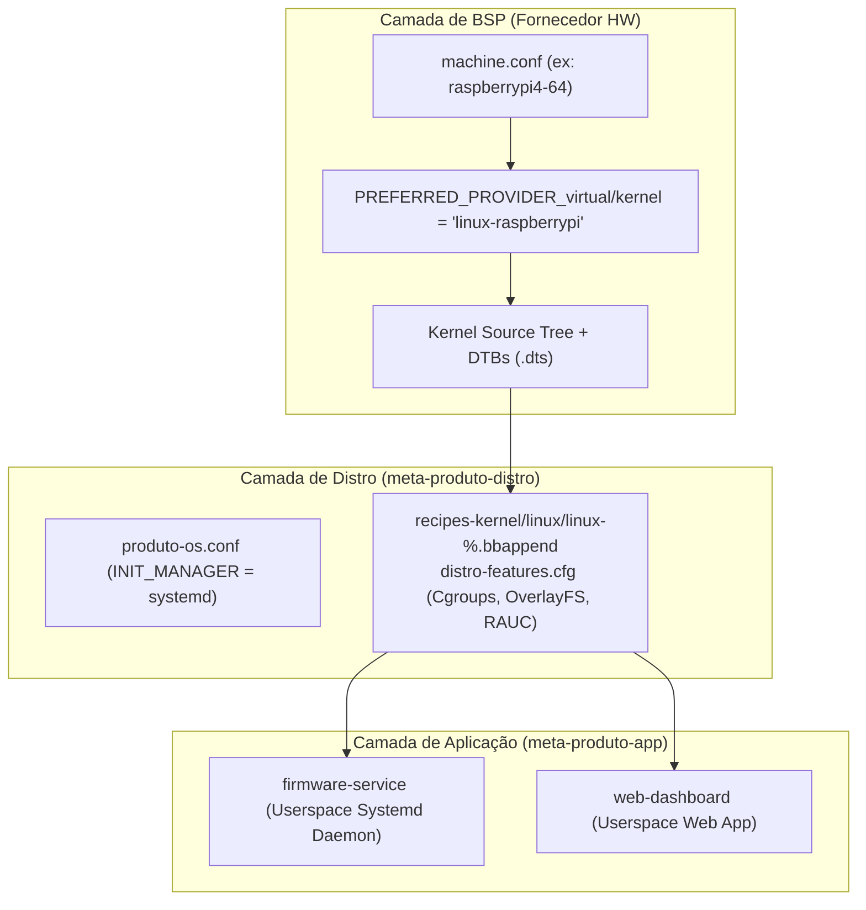

# Arquitetura Profissional Yocto Project — Firmware Embarcado

Implementação de um projeto Yocto profissional com arquitetura multi-layer modular, seguindo rigorosamente as diretrizes do **Yocto Project Kernel Development Manual (`kernel-dev`)**, usando **Scarthgap (5.0 LTS)** e **KAS** para orquestração reprodutível.

## User Review Required

> [!IMPORTANT]
> **Alinhamento com o Yocto Kernel Development Manual**:
> 1. **Separação BSP vs Distro no Kernel**: O kernel em si (código-fonte, device trees, patches de hardware) pertence à **Layer de BSP**.
> 2. **Kernel Configuration Fragments (`.cfg`)**: Requisitos de SO (como Cgroups para systemd, OverlayFS para RAUC/RootFS read-only) pertencem à **Layer de Distribuição** (`meta-produto-distro/recipes-kernel/linux`).
> 3. **Abstração por `linux-%.bbappend`**: Para garantir que os fragments `.cfg` da distro funcionem independentemente do kernel do fornecedor (`linux-yocto`, `linux-raspberrypi`, `linux-imx`, `linux-ti-staging`), usamos wildcard `linux-%.bbappend` ou appends orientados a distro.
> 4. **Camada de Aplicação Isenta de Hardware**: A `meta-produto-app` é mantida 100% em userspace, sem acoplamento com o kernel ou hardware.

> [!IMPORTANT]
> **Nomenclatura do Projeto**: Usando `produto` como prefixo genérico (ex: `produto-os`, `produto-image-base`). Se desejar outro nome, informe antes de iniciar.

## Open Questions

> [!IMPORTANT]
> **1. Receitas de Aplicação (`firmware-service` e `web-dashboard`):**
> Você já tem código-fonte para essas aplicações ou devo criar receitas skeleton com arquivos de serviço systemd e placeholders para builds futuros?

> [!IMPORTANT]
> **2. Kernel Config Fragments:**
> Os fragments configurados na distro habilitam: Cgroups v2 (systemd), OverlayFS (RAUC/Containers), SquashFS e Watchdog. Há alguma outra funcionalidade de kernel necessária para o seu produto?

---

## Análise de Conformidade com o Yocto Kernel Dev Manual

O Yocto Project Kernel Development Manual estabelece 5 pilares fundamentais para projetos profissionais:

1. **Kernel Configuration Fragments (`.cfg`)**:
   - Em vez de manter arquivos `.config` monolíticos e gigantescos, personalizações devem ser feitas via pequenos arquivos de fragmento `.cfg` contendo apenas as opções que mudam (`CONFIG_FOO=y`).
   - *Status no Plano*: **100% em conformidade**. Usamos `custom-features.cfg` adicionado via `SRC_URI += "file://custom-features.cfg"`.

2. **Descolamento entre BSP (Hardware/Kernel) e Distro (Políticas de SO)**:
   - A layer de BSP define o *kernel provider* (`PREFERRED_PROVIDER_virtual/kernel`), a árvore de fontes do kernel, Device Trees (`.dts`) e patches de suporte ao SoC.
   - A layer de Distribuição define *quais recursos o SO exige do kernel* (ex: suporte a systemd, cgroups, namespaces, cifragem/LUKS, overlayfs).
   - *Status no Plano*: **Ajustado e Refinado**. Movemos os fragments de kernel do SO da camada de app para `meta-produto-distro/recipes-kernel/linux/linux-%.bbappend`.

3. **Portabilidade de BSP (Troca de Hardware Sem Alterar o SO)**:
   - Ao usar wildcard `linux-%.bbappend` (ou direcionar via `virtual/kernel`), as políticas de kernel da distro aplicam-se automaticamente se você compilar para Raspberry Pi (`linux-raspberrypi`), NXP i.MX (`linux-imx`), Texas Instruments (`linux-ti-staging`) ou QEMU (`linux-yocto`).
   - *Status no Plano*: **100% em conformidade**.

4. **Isolamento de Userspace / Aplicação**:
   - A `meta-produto-app` fica restrita a receitas de aplicação (business logic), dependendo apenas de interfaces padrão do Linux (POSIX, Sockets, Sysfs/Devfs, APIs REST/gRPC).
   - *Status no Plano*: **100% em conformidade**.

---

## Proposed Changes

### Visão Geral da Hierarquia Final

```text
yocto_workspace/
├── kas-project.yml               # Arquivo principal do KAS (Scarthgap LTS)
├── README.md
│
├── layers/                       # Gerenciado pelo KAS
│   ├── poky/
│   ├── meta-openembedded/
│   ├── meta-raspberrypi/         # Layer de BSP (Exemplo)
│   └── meta-rauc/
│
└── meta-custom/
    ├── meta-produto-distro/      # LAYER 1: Distribuição, SO Base & Kernel Policy
    │   ├── conf/
    │   │   ├── layer.conf
    │   │   └── distro/
    │   │       └── produto-os.conf
    │   ├── recipes-core/
    │   │   ├── images/
    │   │   │   └── produto-image-base.bb
    │   │   ├── systemd/
    │   │   │   ├── systemd_%.bbappend
    │   │   │   └── systemd/
    │   │   │       ├── 80-wired.network
    │   │   │       └── 10-journald-persistent.conf
    │   │   └── rauc/
    │   │       ├── rauc-conf.bbappend
    │   │       └── rauc-conf/
    │   │           └── system.conf
    │   ├── recipes-kernel/       # Kernel Config Fragments (Políticas de SO)
    │   │   └── linux/
    │   │       ├── linux-%.bbappend
    │   │       └── files/
    │   │           └── distro-features.cfg
    │   └── wic/
    │       └── produto-partitions.wks
    │
    └── meta-produto-app/         # LAYER 2: Aplicação de Negócio (Userspace Puro)
        ├── conf/
        │   └── layer.conf
        ├── recipes-core/
        │   └── images/
        │       └── produto-image-prod.bb
        └── recipes-apps/
            ├── firmware-service/
            │   ├── firmware-service_1.0.0.bb
            │   └── files/
            │       └── firmware-service.service
            └── web-dashboard/
                └── web-dashboard_git.bb
```

---

### Componente 0 — Raiz do Projeto

#### [NEW] [kas-project.yml](file:///home/stephan/Documents/TCC/yocto_workspace/kas-project.yml)

```yaml
header:
  version: 14

machine: qemux86-64
distro: produto-os
target:
  - produto-image-base

repos:
  poky:
    url: "https://git.yoctoproject.org/poky"
    branch: "scarthgap"
    path: "layers/poky"
    layers:
      meta:
      meta-poky:
      meta-yocto-bsp:

  meta-openembedded:
    url: "https://git.openembedded.org/meta-openembedded"
    branch: "scarthgap"
    path: "layers/meta-openembedded"
    layers:
      meta-oe:
      meta-python:
      meta-networking:
      meta-filesystems:

  meta-rauc:
    url: "https://github.com/rauc/meta-rauc.git"
    branch: "scarthgap"
    path: "layers/meta-rauc"

  # --- BSP PLACEHOLDER ---
  # Descomente e ajuste quando definir o hardware alvo:
  # meta-raspberrypi:
  #   url: "https://git.yoctoproject.org/meta-raspberrypi"
  #   branch: "scarthgap"
  #   path: "layers/meta-raspberrypi"

  meta-produto-distro:
    path: "meta-custom/meta-produto-distro"

  meta-produto-app:
    path: "meta-custom/meta-produto-app"

local_conf_header:
  build-settings: |
    CONF_VERSION = "2"
    PACKAGE_CLASSES = "package_ipk"
    SDKMACHINE = "x86_64"
    USER_CLASSES = "buildstats"
    PATCHRESOLVE = "noop"
    EXTRA_IMAGE_FEATURES += "debug-tweaks"
    DL_DIR = "${TOPDIR}/../downloads"
    SSTATE_DIR = "${TOPDIR}/../sstate-cache"
```

#### [NEW] [README.md](file:///home/stephan/Documents/TCC/yocto_workspace/README.md)

Documentação com diretrizes de arquitetura, portabilidade de BSP e fluxo KAS.

---

### Componente 1 — Layer de Distribuição (`meta-produto-distro`)

> Prioridade: **8** | Responsabilidade: Políticas de SO, init system, rede, segurança, WIC e Kernel OS Features.

#### [NEW] [layer.conf](file:///home/stephan/Documents/TCC/yocto_workspace/meta-custom/meta-produto-distro/conf/layer.conf)

```bitbake
BBPATH .= ":${LAYERDIR}"

BBFILES += " \
    ${LAYERDIR}/recipes-*/*/*.bb \
    ${LAYERDIR}/recipes-*/*/*.bbappend \
"

BBFILE_COLLECTIONS += "meta-produto-distro"
BBFILE_PATTERN_meta-produto-distro = "^${LAYERDIR}/"
BBFILE_PRIORITY_meta-produto-distro = "8"

LAYERDEPENDS_meta-produto-distro = "core openembedded-layer meta-filesystems"
LAYERSERIES_COMPAT_meta-produto-distro = "scarthgap"
```

#### [NEW] [produto-os.conf](file:///home/stephan/Documents/TCC/yocto_workspace/meta-custom/meta-produto-distro/conf/distro/produto-os.conf)

```bitbake
DISTRO = "produto-os"
DISTRO_NAME = "Produto OS"
DISTRO_VERSION = "1.0.0"
DISTRO_CODENAME = "scarthgap"
SDK_VENDOR = "-produtosdk"
TARGET_VENDOR = "-produto"
MAINTAINER = "Stephan <stephan@produto.dev>"

# Init Manager - systemd exclusivo (Scarthgap canonical way)
INIT_MANAGER = "systemd"

# Distro Features
DISTRO_FEATURES:append = " \
    wifi \
    bluetooth \
    pam \
    usrmerge \
    rauc \
    systemd-resolved \
    systemd-networkd \
"
DISTRO_FEATURES:remove = "3g pcmcia nfc"

# Hostname padrão
hostname:pn-base-files = "produto-device"

# Formato de imagem padrão
IMAGE_FSTYPES = "ext4.gz wic wic.bmap"
IMAGE_LINGUAS = "en-us pt-br"
```

#### [NEW] [recipes-kernel/linux/linux-%.bbappend](file:///home/stephan/Documents/TCC/yocto_workspace/meta-custom/meta-produto-distro/recipes-kernel/linux/linux-%.bbappend)

> Conforme o Yocto Kernel Dev Manual, usamos `linux-%.bbappend` na distro layer para injetar as configs de kernel necessárias pelo SO de forma transparente para qualquer kernel de BSP.

```bitbake
FILESEXTRAPATHS:prepend := "${THISDIR}/files:"

SRC_URI:append = " file://distro-features.cfg"
```

`files/distro-features.cfg`:
```kconfig
# --- Requisitos do systemd ---
CONFIG_CGROUPS=y
CONFIG_CGROUP_DEVICE=y
CONFIG_CGROUP_CPUACCT=y
CONFIG_CGROUP_PERF=y
CONFIG_MEMCG=y
CONFIG_NAMESPACES=y
CONFIG_UTS_NS=y
CONFIG_IPC_NS=y
CONFIG_PID_NS=y
CONFIG_NET_NS=y
CONFIG_AUTOFS4_FS=y

# --- Requisitos de Atualização OTA & Segurança (RAUC / Read-only / OverlayFS) ---
CONFIG_OVERLAY_FS=y
CONFIG_SQUASHFS=y
CONFIG_SQUASHFS_XZ=y
CONFIG_BLK_DEV_DM=y
CONFIG_DM_CRYPT=y

# --- Estabilidade & Watchdog ---
CONFIG_WATCHDOG=y
CONFIG_WATCHDOG_CORE=y
```

#### [NEW] [produto-image-base.bb](file:///home/stephan/Documents/TCC/yocto_workspace/meta-custom/meta-produto-distro/recipes-core/images/produto-image-base.bb)

```bitbake
SUMMARY = "Produto OS - Imagem Base de Desenvolvimento"
DESCRIPTION = "Imagem Linux embarcado com systemd, rede e ferramentas de diagnóstico"
LICENSE = "MIT"

inherit core-image

IMAGE_INSTALL:append = " \
    packagegroup-core-boot \
    packagegroup-core-full-cmdline \
    systemd-analyze \
    htop \
    curl \
    openssh-sftp-server \
    nano \
    less \
    tree \
"

IMAGE_FEATURES += " \
    ssh-server-openssh \
    debug-tweaks \
"

IMAGE_FSTYPES = "ext4.gz wic wic.bmap"
WKS_FILE = "produto-partitions.wks"
```

#### [NEW] [systemd_%.bbappend](file:///home/stephan/Documents/TCC/yocto_workspace/meta-custom/meta-produto-distro/recipes-core/systemd/systemd_%.bbappend)

Com arquivos auxiliares `systemd/80-wired.network` e `systemd/10-journald-persistent.conf`.

#### [NEW] [rauc-conf.bbappend](file:///home/stephan/Documents/TCC/yocto_workspace/meta-custom/meta-produto-distro/recipes-core/rauc/rauc-conf.bbappend)

Com arquivo auxiliar `rauc-conf/system.conf`.

#### [NEW] [produto-partitions.wks](file:///home/stephan/Documents/TCC/yocto_workspace/meta-custom/meta-produto-distro/wic/produto-partitions.wks)

Esquema de particionamento GPT dual-boot A/B para RAUC.

---

### Componente 2 — Layer de Aplicação (`meta-produto-app`)

> Prioridade: **10** | Responsabilidade: Serviços de negócio e Dashboard. Totalmente desacoplada do hardware.

#### [NEW] [layer.conf](file:///home/stephan/Documents/TCC/yocto_workspace/meta-custom/meta-produto-app/conf/layer.conf)

```bitbake
BBPATH .= ":${LAYERDIR}"

BBFILES += " \
    ${LAYERDIR}/recipes-*/*/*.bb \
    ${LAYERDIR}/recipes-*/*/*.bbappend \
"

BBFILE_COLLECTIONS += "meta-produto-app"
BBFILE_PATTERN_meta-produto-app = "^${LAYERDIR}/"
BBFILE_PRIORITY_meta-produto-app = "10"

LAYERDEPENDS_meta-produto-app = "core meta-produto-distro"
LAYERSERIES_COMPAT_meta-produto-app = "scarthgap"
```

#### [NEW] [produto-image-prod.bb](file:///home/stephan/Documents/TCC/yocto_workspace/meta-custom/meta-produto-app/recipes-core/images/produto-image-prod.bb)

```bitbake
SUMMARY = "Produto OS - Imagem de Produção"
DESCRIPTION = "Imagem completa com serviços de aplicação e dashboard web"
LICENSE = "MIT"

require recipes-core/images/produto-image-base.bb

IMAGE_INSTALL:append = " \
    firmware-service \
    web-dashboard \
    rauc \
"

IMAGE_FEATURES:remove = "debug-tweaks"
IMAGE_FEATURES += "read-only-rootfs"
```

#### [NEW] [firmware-service_1.0.0.bb](file:///home/stephan/Documents/TCC/yocto_workspace/meta-custom/meta-produto-app/recipes-apps/firmware-service/firmware-service_1.0.0.bb)

Com arquivo auxiliar `files/firmware-service.service`.

#### [NEW] [web-dashboard_git.bb](file:///home/stephan/Documents/TCC/yocto_workspace/meta-custom/meta-produto-app/recipes-apps/web-dashboard/web-dashboard_git.bb)

Receita skeleton para dashboard web em userspace.

---

## Fluxo de Abstração do Kernel & BSP



---

## Verification Plan

### Automated Tests (Build Validation)

1. **Parse Test**:
   ```bash
   kas shell kas-project.yml -c "bitbake-layers show-layers"
   ```
2. **Kernel Config Audit**:
   ```bash
   kas shell kas-project.yml -c "bitbake -e virtual/kernel | grep ^SRC_URI="
   ```
3. **Build da Imagem Base**:
   ```bash
   kas build kas-project.yml
   ```
4. **QEMU Boot Test**:
   ```bash
   kas shell kas-project.yml -c "runqemu qemux86-64 nographic"
   ```

### Critérios de Aceitação (Kernel Dev Standard)

- [ ] Fragmentos `.cfg` injetados via `linux-%.bbappend` na distro layer
- [ ] Troca de BSP/MACHINE sem necessidade de alterar `meta-produto-distro` ou `meta-produto-app`
- [ ] `meta-produto-app` é 100% puramente userspace
- [ ] Imagem compila limpa para `qemux86-64` via KAS em Scarthgap (Yocto 5.0)
