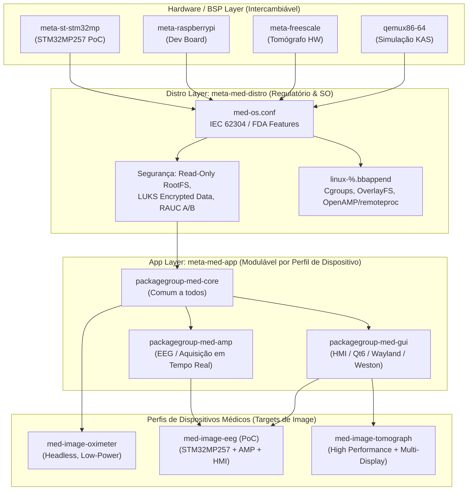

# Arquitetura Profissional Yocto Project — Plataforma para Dispositivos Médicos (TCC)

Arquitetura modular de alto nível para geração de distribuições Linux Embarcado voltadas a **Dispositivos Médicos** (conforme diretrizes IEC 62304 / FDA Cybersecurity), usando **Yocto Scarthgap (5.0 LTS)** e **KAS**.

Design projetado para ser genérico e reutilizável:
- **PoC (Proof of Concept)**: Eletroencefalograma (EEG) com AMP (Asymmetric Multiprocessing: Linux no Cortex-A + FreeRTOS no Cortex-M via `remoteproc`/`rpmsg`) e interface gráfica HMI no **STM32MP257**.
- **Versatilidade**: A mesma arquitetura pode gerar imagens para um **Oxímetro** (headless, ultracompacto) ou um **Tomógrafo** (alta performance, múltiplos displays) apenas alterando a `MACHINE` e as *features* selecionadas.

---

## User Review Required

> [!IMPORTANT]
> **Identidade do Projeto**: Atualizamos os nomes para refletir a plataforma médica:
> - Distro: **`med-os`** (Layer: `meta-med-distro`)
> - Aplicação: **`meta-med-app`** (com seletores modulares para HMI/GUI, AMP, Telemetria)
> - Imagens Target: `med-image-base` (SO médico headless), `med-image-eeg` (PoC EEG com GUI + AMP), `med-image-prod` (Produção genérica)

> [!IMPORTANT]
> **Decisão de BSP para o PoC (STM32MP257)**:
> O KAS configurará `qemux86-64` como machine padrão de desenvolvimento sem hardware, deixando a layer `meta-st-stm32mp` pronta para ser habilitada no KAS assim que você iniciar os testes no STM32MP257.

---

## Estrutura da Plataforma Médica (Modularidade Explicada)



---

## Proposed Changes

### Estrutura Final do Repositório (`meu-projeto-firmware/`)

```text
yocto_workspace/
├── kas-project.yml               # Orquestrador KAS com perfis (QEMU / STM32MP2)
├── README.md                     # Documentação de Arquitetura Médica & TCC
│
├── layers/                       # Gerenciado pelo KAS
│   ├── poky/
│   ├── meta-openembedded/
│   ├── meta-st-stm32mp/          # BSP STM32MP257 (comentado no KAS até uso)
│   └── meta-rauc/
│
└── meta-custom/
    ├── meta-med-distro/          # LAYER 1: Políticas de SO Médico & Segurança
    │   ├── conf/
    │   │   ├── layer.conf
    │   │   └── distro/
    │   │       └── med-os.conf
    │   ├── recipes-core/
    │   │   ├── images/
    │   │   │   └── med-image-base.bb
    │   │   ├── systemd/
    │   │   │   ├── systemd_%.bbappend
    │   │   │   └── systemd/
    │   │   │       ├── 80-wired.network
    │   │   │       └── 10-journald-audit.conf
    │   │   └── rauc/
    │   │       ├── rauc-conf.bbappend
    │   │       └── rauc-conf/
    │   │           └── system.conf
    │   ├── recipes-kernel/
    │   │   └── linux/
    │   │       ├── linux-%.bbappend
    │   │       └── files/
    │   │           └── med-kernel-features.cfg
    │   └── wic/
    │       └── med-partitions.wks
    │
    └── meta-med-app/             # LAYER 2: Módulos de Aplicação (EEG, HMI, AMP)
        ├── conf/
        │   └── layer.conf
        ├── recipes-core/
        │   ├── packagegroups/
        │   │   ├── packagegroup-med-core.bb
        │   │   ├── packagegroup-med-amp.bb
        │   │   └── packagegroup-med-gui.bb
        │   └── images/
        │       ├── med-image-eeg.bb        # Target do PoC (EEG + AMP + HMI)
        │       └── med-image-oximeter.bb   # Exemplo: Oxímetro (Headless)
        └── recipes-apps/
            ├── eeg-acquisition-service/    # Daemon de comunicação IPC (rpmsg)
            │   ├── eeg-acquisition-service_1.0.0.bb
            │   └── files/
            │       └── eeg-acquisition.service
            └── eeg-hmi-gui/                # Interface gráfica HMI
                └── eeg-hmi-gui_1.0.0.bb
```

---

### Detalhes das Camadas Modulares

#### 1. Distro Layer (`meta-med-distro`) — Requisitos Cibersegurança & SO Médico

* **`med-os.conf`**: Habilita `INIT_MANAGER = "systemd"`, `rauc`, `usrmerge`, `pam`, `virtualization`, e desativa protocolos legados/inseguros.
* **`med-kernel-features.cfg`**:
  * `CONFIG_REMOTEPROC=y` & `CONFIG_RPMSG_CHAR=y` (Suporte genérico a AMP / Co-processadores Cortex-M via OpenAMP).
  * `CONFIG_CGROUPS=y` & `CONFIG_NAMESPACES=y` (Isolamento de processos de dispositivos médicos).
  * `CONFIG_OVERLAY_FS=y` (Suporte a sistemas de arquivos imutáveis/read-only rootfs).
  * `CONFIG_SECURITY=y` & `CONFIG_AUDIT=y` (Trilha de auditoria para conformidade com normas médicas).
* **`med-partitions.wks`**: Estrutura A/B robusta com partição `/data` criptografável.

---

#### 2. App Layer (`meta-med-app`) — Módulos Selecionáveis por Tipo de Equipamento

Em vez de criar uma aplicação monolítica, dividimos em **Packagegroups Funcionais**:

1. **`packagegroup-med-core.bb`**: Serviços comuns de diagnóstico, logging, auditoria e atualização OTA (presente em QUALQUER dispositivo médico: oxímetro, EEG ou tomógrafo).
2. **`packagegroup-med-amp.bb`**: Utilitários e serviços de co-processamento em tempo real (`openamp`, `libmetal`, `eeg-acquisition-service`). Presente no EEG e dispositivos com aquisição analógica de alta velocidade.
3. **`packagegroup-med-gui.bb`**: Pilha gráfica de HMI (Wayland/Weston, Qt6 / Flutter / HTML5 engine). Presente no EEG e Tomógrafo, porém **totalmente omitida** no Oxímetro!

---

#### 3. Targets de Imagem Flexíveis

* **`med-image-base.bb`**: SO médico base mínimo para validação de plataforma/hardware.
* **`med-image-eeg.bb` (PoC do TCC)**:
  ```bitbake
  SUMMARY = "Imagem PoC - Eletroencefalograma (EEG) com AMP e HMI"
  inherit core-image

  IMAGE_INSTALL:append = " \
      packagegroup-med-core \
      packagegroup-med-amp \
      packagegroup-med-gui \
      eeg-acquisition-service \
      eeg-hmi-gui \
  "
  ```
* **`med-image-oximeter.bb` (Exemplo Headless)**:
  ```bitbake
  SUMMARY = "Imagem Oxímetro - Headless Low-Power"
  inherit core-image

  IMAGE_INSTALL:append = " \
      packagegroup-med-core \
  "
  # Zero dependências de GUI ou Display!
  ```

---

## Verification Plan

1. **Validação de Sintaxe & Modularidade**:
   ```bash
   kas shell kas-project.yml -c "bitbake-layers show-layers"
   ```
2. **Build da Imagem PoC (EEG)**:
   ```bash
   kas build kas-project.yml
   ```
3. **Validação do Modulariedade Headless (Oxímetro)**:
   Verificar que a receita `med-image-oximeter` não traz pacotes do Wayland/Weston/Qt6.
4. **Boot QEMU**:
   ```bash
   kas shell kas-project.yml -c "runqemu qemux86-64 nographic"
   ```

---

## Próximos Passos

Com este plano aprovado, executarei a criação de todos os diretórios e arquivos da estrutura profissional para o seu TCC!
