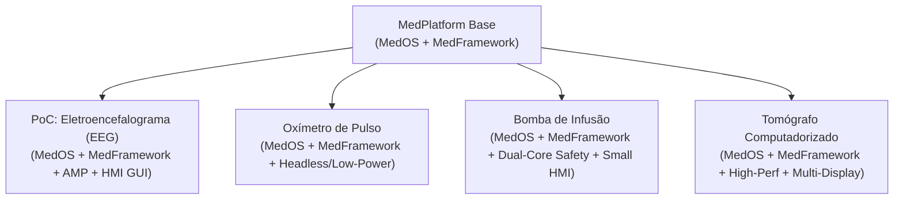

# MedPlatform: A Modular Reference Architecture for Medical Device Linux Platforms

## Implementation and Validation Through an EEG Proof of Concept

> **Trabalho de Conclusão de Curso (TCC)** — Proposta de Arquitetura de Referência para Distribuições Linux Embarcado em Dispositivos Médicos com validação experimental orientada a métricas.

---

> [!NOTE]
> **Declaração Central de Enquadramento**:
> *"Diferentemente de trabalhos que propõem um dispositivo médico específico, este trabalho propõe uma arquitetura de referência reutilizável para a construção de múltiplas classes de dispositivos médicos embarcados."*

---

## 1. Problema de Pesquisa, Hipótese & Contribuições

### Problema de Pesquisa
Atualmente, plataformas Linux para dispositivos médicos são frequentemente desenvolvidas de forma ad-hoc e monolítica para cada equipamento específico. Esse acoplamento direto entre a lógica da aplicação, as bibliotecas do sistema e a BSP do fabricante dificulta a reutilização de código, encarece a manutenção e compromete a rastreabilidade exigida por normas de segurança funcional.

### Hipótese de Pesquisa
Uma **arquitetura de referência modular baseada no Yocto Project (MedPlatform)**, dividida formalmente nas camadas **BSP → MedOS → MedFramework → MedApp**, permite:
1. **Aumentar significativamente a reutilização de código e receitas** entre diferentes classes de dispositivos médicos.
2. **Garantir a portabilidade entre arquiteturas de hardware** (x86, ARM64, STM32MP257) com modificação restrita à camada de BSP e zero alterações no código da aplicação.
3. **Facilitar o atendimento aos requisitos de rastreabilidade, particionamento e cibersegurança** recomendados pela norma **IEC 62304** e guias da **FDA**.

### Contribuições Científicas e Tecnológicas
Este trabalho apresenta quatro contribuições principais:
1. **Uma Arquitetura de Referência em Camadas** para plataformas Linux de dispositivos médicos (`MedPlatform`).
2. **Um Framework de Abstração Médica (`MedFramework`)** que desacopla aplicações de negócio da infraestrutura do sistema operacional e do hardware.
3. **Uma Metodologia Estruturada** para a construção de distribuições médicas reutilizáveis utilizando o Yocto Project (`MedOS`).
4. **Uma Avaliação Experimental Orientada a Métricas** que quantifica reutilização de código, esforço de portabilidade, dependências (DAG) e *footprint*.

---

## 2. Visão Conceitual da Plataforma (`MedPlatform`)

```text
                       +-----------------------------------+
                       |         Medical Application       |
                       |  (EEG / Oxímetro / Tomógrafo)     |
                       +-----------------------------------+
                                         │
                                         ▼ (Medical APIs)
                       +-----------------------------------+
                       |           MedFramework            |
                       | (IPC, Logger, Storage, Device...) |
                       +-----------------------------------+
                                         │
                                         ▼ (Distro Policy / POSIX)
                       +-----------------------------------+
                       |           MedOS Platform          |
                       | (Systemd, RAUC, LUKS, Read-Only)  |
                       +-----------------------------------+
                                         │
                                         ▼ (Kernel / Device Tree)
                       +-----------------------------------+
                       |             BSP Layer             |
                       +-----------------------------------+
                                         │
            ┌────────────────────────────┼────────────────────────────┐
            ▼                            ▼                            ▼
     [ Hardware A ]               [ Hardware B ]               [ Hardware C ]
    (STM32MP257 - PoC)            (Raspberry Pi)                 (QEMU x86)
```

---

## 3. Estrutura das Camadas no Yocto (`yocto_workspace/`)

```text
yocto_workspace/
├── kas-project.yml               # Orquestrador KAS reprodutível
├── README.md                     # Documentação de Arquitetura & Pesquisa
│
├── layers/                       # Layers externas baixadas pelo KAS
│   ├── poky/
│   ├── meta-openembedded/
│   ├── meta-st-stm32mp/          # BSP STM32MP257 (PoC)
│   └── meta-rauc/                # Infraestrutura OTA
│
└── meta-custom/
    │
    ├── meta-med-distro/          # LAYER 1: Distribuição & Políticas de SO (MedOS)
    │   ├── conf/
    │   │   ├── layer.conf
    │   │   └── distro/
    │   │       └── med-os.conf
    │   ├── recipes-core/
    │   │   ├── images/
    │   │   │   └── med-image-base.bb
    │   │   ├── systemd/
    │   │   │   ├── systemd_%.bbappend
    │   │   │   └── systemd/
    │   │   │       ├── 80-wired.network
    │   │   │       └── 10-journald-audit.conf
    │   │   └── rauc/
    │   │       ├── rauc-conf.bbappend
    │   │       └── rauc-conf/
    │   │           └── system.conf
    │   ├── recipes-kernel/
    │   │   └── linux/
    │   │       ├── linux-%.bbappend
    │   │       └── files/
    │   │           └── med-kernel-features.cfg
    │   └── wic/
    │       └── med-partitions.wks
    │
    ├── meta-med-framework/       # LAYER 2: Framework de Abstração Médica (MedFramework)
    │   ├── conf/
    │   │   └── layer.conf
    │   └── recipes-framework/
    │       ├── med-framework-api/
    │       │   ├── med-framework-api_1.0.0.bb
    │       │   └── files/
    │       │       ├── include/
    │       │       │   ├── MedicalIPC.h           # Abstração OpenAMP / rpmsg / IPC
    │       │       │   ├── MedicalLogger.h        # Abstração Journald / Audit / IEC 62304
    │       │       │   ├── MedicalStorage.h       # Abstração Armazenamento Criptografado
    │       │       │   ├── MedicalUpdate.h        # Abstração RAUC OTA D-Bus
    │       │       │   ├── MedicalConfiguration.h  # Gerenciamento de Parâmetros / Calibração
    │       │       │   └── MedicalDevice.h       # Abstração Sensores / Atuadores
    │       │       └── src/
    │       │           └── med-framework.cpp
    │       └── packagegroups/
    │           └── packagegroup-med-framework.bb
    │
    └── meta-med-app/             # LAYER 3: Aplicações & Perfis de Dispositivo (MedApp)
        ├── conf/
        │   └── layer.conf
        ├── recipes-core/
        │   ├── packagegroups/
        │   │   ├── packagegroup-med-core.bb
        │   │   ├── packagegroup-med-amp.bb
        │   │   └── packagegroup-med-gui.bb
        │   └── images/
        │       ├── med-image-eeg.bb        # Target de Validação PoC (EEG)
        │       └── med-image-oximeter.bb   # Target de Validação (Oxímetro Headless)
        └── recipes-apps/
            ├── eeg-acquisition-service/    # Servidor IPC usando MedFramework
            │   ├── eeg-acquisition-service_1.0.0.bb
            │   └── files/
            │       └── eeg-acquisition.service
            └── eeg-hmi-gui/                # Interface HMI (Qt/Wayland)
                └── eeg-hmi-gui_1.0.0.bb
```

---

## 4. Detalhamento do `MedFramework` (APIs de Abstração)

A camada `meta-med-framework` expõe 6 interfaces padronizadas em C++:

1. **`MedicalIPC`**: Interface de comunicação entre o SO Linux (Cortex-A) e co-processadores de tempo real (Cortex-M via OpenAMP `rpmsg`) ou IPC local inter-processos.
2. **`MedicalLogger`**: Gerenciador de logs estruturados e auditáveis em conformidade com as diretrizes de rastreabilidade da IEC 62304.
3. **`MedicalStorage`**: Abstração para gravação segura de dados do paciente e registros biomédicos em partição criptografada (`/data`).
4. **`MedicalUpdate`**: Interface com o serviço RAUC para consulta de status do slot de boot (A/B) e disparo de atualizações de firmware OTA.
5. **`MedicalConfiguration`**: Gerenciador de parâmetros de calibração, limites de alarme e perfis operacionais com integridade verificada.
6. **`MedicalDevice`**: Interface genérica para abstração de periféricos, sensores biomédicos (ADCs, AFE) e atuadores.

---

## 5. Generalização entre Classes de Dispositivos Médicos

Para demonstrar a versatilidade da `MedPlatform`, a arquitetura suporta múltiplos perfis de equipamentos a partir do mesmo código-base:



---

## 6. Avaliação Experimental (Métricas Científicas)

| Métrica Científica | Pergunta Respondida | Método de Avaliação |
|:-------------------|:--------------------|:--------------------|
| **Índice de Reutilização de Código (%)** | Qual a porcentagem de receitas e linhas de configuração compartilhadas entre diferentes perfis (Oxímetro vs EEG)? | Análise comparativa da árvore de dependências (`bitbake-layers`) entre `med-image-oximeter` e `med-image-eeg`. |
| **Esforço de Portabilidade de Hardware** | Quantas linhas de código/configuração e arquivos precisam ser alterados para portar a plataforma entre diferentes hardwares? | `git diff` e contagem de alterações nas camadas `meta-med-*` ao alternar a `MACHINE` (QEMU vs Raspberry Pi vs STM32MP257). |
| **Grafo de Dependências (DAG)** | As camadas mantêm acoplamento estritamente unidirecional sem ciclos? | Exportação e análise do grafo via `bitbake-layers show-depends`. |
| **Métricas de Footprint & Build** | Qual o consumo de espaço em disco (RootFS) e tempo de compilação de cada perfil? | Medição via ferramentas de `buildstats` do BitBake. |

---

## Verification & Execution Plan

1. **Criação da Estrutura Física**: Criar diretórios e receitas das 3 camadas customizadas (`meta-med-distro`, `meta-med-framework`, `meta-med-app`).
2. **Validação de Layers**:
   ```bash
   kas shell kas-project.yml -c "bitbake-layers show-layers"
   ```
3. **Validação de Dependências entre Camadas**:
   ```bash
   kas shell kas-project.yml -c "bitbake-layers show-depends"
   ```
4. **Build da Imagem PoC (`med-image-eeg`)**:
   ```bash
   kas build kas-project.yml
   ```
5. **Teste de Boot em QEMU**:
   ```bash
   kas shell kas-project.yml -c "runqemu qemux86-64 nographic"
   ```
